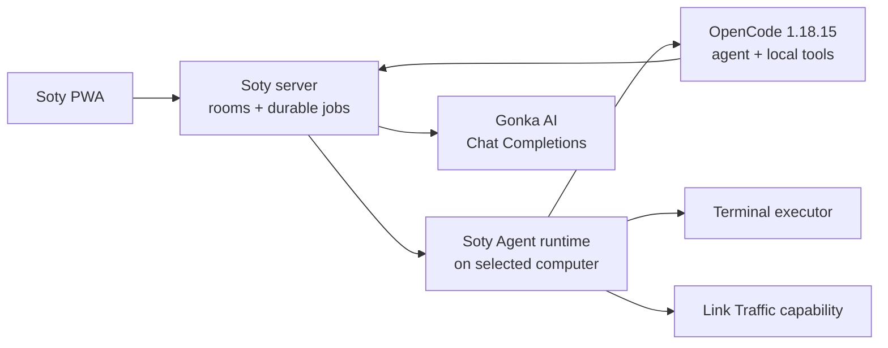

# Soty architecture

## Product boundary

Soty owns the secure path between the PWA and a selected computer: binding,
durable delivery, ordered events, cancellation, installation, updates,
terminal commands, and explicitly granted traffic routes. It does not contain
an LLM loop, planner, memory system, or a second implementation of agent tools.

There is exactly one AI agent: [OpenCode](https://github.com/anomalyco/opencode).
It is selected and version-pinned by the product, not discovered through a
generic adapter registry. Gonka AI is its only configured model provider.

The PWA, server, and installed runtime are the three deployable applications.
The server remains one process; durable jobs are a module, not a microservice.

## Fixed contracts

Jobs have one of three explicit kinds:

- `agent` — always executed by OpenCode through Gonka;
- `command` — a direct terminal command;
- `script` — a generated script executed by its declared interpreter.

There is no `auto-chat`, agent selection, fallback agent, or configurable
external-agent command. Terminal and traffic are device capabilities, not AI
agents.

Jobs move through `queued → leased → running → succeeded | failed | cancelled`.
An expired lease returns unfinished work to the queue. State is persisted in
`DATA_DIR/connector-store.json`; a server or PWA restart therefore does not
lose a task or its ordered event cursor. Retention, payload size, event count,
and execution time are bounded.

## Installed runtime

The runtime has a small, concrete responsibility set:

1. bind one installation to a Link and Device;
2. authenticate with a random per-installation token;
3. publish whether the fixed OpenCode + Gonka agent is ready;
4. lease and execute the three job kinds;
5. stream bounded events, renew leases, and return results;
6. cancel the entire child process tree;
7. update itself and verify the release SHA-256;
8. install the pinned official OpenCode archive and verify its platform SHA-256.

The installed product is one managed package even though it has two executable
parts: the small Soty connector and the pinned OpenCode runtime. The connector
checks the immutable release manifest at startup and every ten minutes. It
downloads the next connector to a staging path, verifies SHA-256, runs its
offline release self-test, keeps the previous executable, and restarts through
the supervisor. The supervisor rolls back when the candidate exits before its
15-second startup confirmation. After the connector is healthy, it converges
the managed OpenCode binary to the version and platform hash embedded in the
same release.

Building a release does not publish it. Installed computers update only after
the matching `manifest.json` and hashed assets are deployed to the configured
update origin. Runtime health exposes the current/latest version, last check,
result, and error so "not published", "not checked", integrity failures, and
successful updates are distinguishable.

OpenCode is launched through its documented headless JSON interface. Its custom
`gonka` provider uses the native OpenAI-compatible provider supported by
[OpenCode providers](https://dev.opencode.ai/docs/providers), so Soty no longer
contains the former Responses ↔ Chat Completions translation layer. The
provider points to the authenticated Soty server proxy. The computer sends its
existing per-installation connector token; only the server holds the Gonka key
and upstream URL. The proxy accepts the pinned DeepSeek model only, limits
request size and per-installation concurrency, forwards streaming responses,
and never logs or returns either credential. Sessions are resumed by the
OpenCode session ID. See the
[OpenCode CLI documentation](https://dev.opencode.ai/docs/cli/) for the
underlying `run --format json` contract.

Runtime-owned OpenCode config, data, cache, and state live inside the Soty Agent
installation. Automatic OpenCode updates, default plugins, implicit Claude
imports, model-list fetching, auto-sharing, and automatic LSP downloads are
disabled. Upgrades are deliberate: change the pinned version and official
checksums in one release manifest, then run the full protocol test.

## Security and failure behavior

- Link IDs and installation tokens are independent high-entropy values.
- The server stores only token SHA-256 digests and compares them in constant
  time; tokens do not enter the PWA.
- The loopback API accepts the configured Soty origin and local development
  origins only.
- Agent working directories must be inside configured `allowedRoots`.
- OpenCode receives an isolated state directory and a fixed permission policy;
  access outside the selected workspace is denied.
- The Gonka key and upstream coordinate exist only in server environment; they
  are never shipped in the release manifest, installer, local config, OpenCode
  state, URL, browser storage, logs, or task results.
- Child processes do not inherit `NODE_OPTIONS`.
- Missing server Gonka configuration makes `/ready` and the model proxy fail
  closed. A failed OpenCode probe makes the local agent unavailable; jobs remain
  queued instead of silently falling back.
- Traffic state is independent of agent availability and remains fail-closed.

## Installation and migration

Installers preserve existing Link, Device, installation token, and traffic
settings. Legacy local Gonka settings and `agent-secrets.json` are not read by
the new runtime; the server owns that credential. Legacy `adapters`
configuration is removed because it has no meaning in the fixed architecture.
The store accepts v1 data once and migrates it to v2; a protocol-v1 runtime
cannot lease an `agent` job.

The manifest keeps `agentUrl` and the byte-identical `soty-agent.mjs` asset for
one upgrade window so direct current-user 0.x installs can replace themselves.
One legacy Windows machine layout cannot complete that cutover by self-update:
its old `start-user-agent.ps1` copies the read-only ProgramData 0.x runtime over
the just-updated user runtime before every restart. Those installations require
one elevated rerun of the machine installer. The installer removes the legacy
task, Run entry, and launcher process only after the new connector and OpenCode
have passed bootstrap. This is the only manual migration boundary; the new
supervisor owns all subsequent wrapper updates and rollback automatically.

Windows machine installs retain the system runtime for terminal and traffic and
start a current-user companion for OpenCode; both share one logical Device.
Current-user installation is the default on macOS and Linux.

OpenCode is MIT-licensed. Its license is written beside every managed binary;
repository notices are in [`THIRD_PARTY_NOTICES.md`](../THIRD_PARTY_NOTICES.md).
