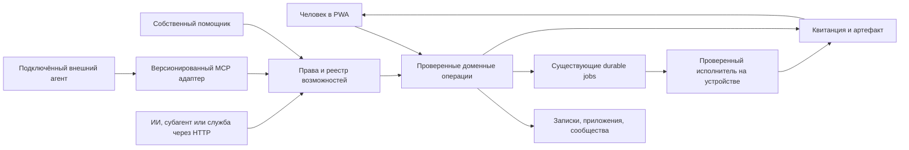

# Соты: единое пространство приложений для людей и любых ИИ

Дата: 30 сентября 2026. Статус: полный план следующей реализации; новые серверные функции этим документом не объявляются выполненными.

Этот документ развивает [согласованную концепцию](soty-apps-first-20260930.md). Сохраняются приложения на первом плане, именные адреса, самостоятельные люди и сообщества, чаты по контексту, карточки и поле сот. Главный новый приоритет — обнаружение, понимание и использование приложений любыми внешними ИИ, агентами и субагентами. Собственный помощник остаётся полноценным клиентом этой общей платформы. Пользователь подтвердил нейтральный графит и мягкие акценты вместо синеватой оболочки.

Проверяемая база — release worktree `C:\Users\Junio\.codex\worktrees\soty-experience-release\соты`, commit `b0af84b8dc6c10f00236ed132565bff3a7212b64`. Аудит текущего запроса — чтение исходников и тестовых сценариев, не повторная проверка production. Корневой `D:\соты` с существующими изменениями не используется как доказательство опубликованной версии. План и отдельный цветовой вариант макета не меняют рабочий сервис.

## 1. Усиленная идея

**Соты — единое пространство приложений с собственными адресами, где люди пользуются сервисами и объединяются вокруг них, а любые подключённые ИИ находят, понимают и используют разрешённые функции этих же приложений, сохраняя общий результат и контроль у владельца.**

Короткое обещание для автора: **«Одно приложение — людям и ИИ».** Пользователь открывает удобный интерфейс, внешний ИИ получает явно предоставленные функции этого же приложения. Общими остаются данные, права, результат, автор и история. Наличие функций для агентов не обязательно: игра без API остаётся полноценным приложением.

«Любые ИИ» — принцип открытой архитектуры: нет обязательной модели, поставщика или собственного помощника Сот. Работа подтверждается для конкретных способов подключения и версий клиентов. Браузерный агент, HTTP-клиент, MCP-клиент, фоновая служба и субагент могут использовать один доменный контракт через подходящий интерфейс. Система без сети или без разрешённого подключения не получает доступ автоматически. Собственный помощник служит удобным примером использования и не получает скрытых привилегий относительно внешнего клиента с тем же допуском.

Три проверяемые цепочки ценности:

1. **Автор:** проект → постоянный адрес → первый человек открыл → сохранил → вернулся.
2. **Человек и агент:** задача → подходящая функция → разрешённое действие → настоящий результат → человек продолжил в приложении.
3. **Устройство и собственный помощник:** выбранный проект на конкретном устройстве → ограниченное поручение → наблюдаемое выполнение → проверка изменений → отдельный выпуск результата.

Главный объект продукта — полезная работа и её результат. Число приложений, агентов, вызовов и время на сайте сами по себе не доказывают ценность. Соты должны экономить переключения, ручное копирование и повторную настройку.

## 2. Как проверяли идею с разных точек зрения

Работали три исследовательские роли одновременно; итог сводит основной агент. Названия точек зрения обозначают вопросы проверки, а не обещание непогрешимости.

| Точка зрения | Главный вопрос | Принятое решение |
|---|---|---|
| «С высоты Сатурна», независимый критик | Получается единый продукт или множество каталогов и панелей? | Одна App-модель, один результат и одни права; агентский вход использует те же приложения |
| «Пять градусов над экраном», обычный человек | Понятно ли, куда нажать и где появится работа? | Основные действия видны; технические детали раскрываются по задаче; короткие подписи сохраняются |
| Внешний агент | Могу ли найти действие, понять контракт и вернуть пригодный результат? | Search → description → authorization → typed operation → receipt + deep link |
| Автор приложения | Сколько нужно переделать, чтобы подключиться? | Маленький SDK/адаптер к существующей логике; функции включаются по одной |
| Инженер устройства и безопасности | Кто реально может выполнить команду и остановить её? | Ограничения исполняет среда и сервер, не только текст инструкции или поле permissions |
| Эксплуатация и экономика | Что случится при таймауте, злоупотреблении и росте расходов? | Устойчивая история заданий, квоты, известный статус побочного эффекта, восстановление и измеряемая стоимость |
| «С точки зрения общественного пространства» | Кто виден, кому доверяют и можно ли уйти? | Добровольная публичность, проверяемые признаки доверия, жалобы, экспорт и переносимость |

Разногласия разрешены так: поле сот остаётся видом связей; карточки — исходным способом запуска. Внешнее обнаружение не приравнивается к праву выполнения. Собственный помощник получает постоянный вход, а общая платформа не зависит от него. Поддержка дополнительных протоколов откладывается до реального спроса; открытый HTTP-контракт и внешняя интеграция входят в ранний выпуск.

## 3. Что сохраняем из текущего продукта

Новая главная не должна удалить полезную инфраструктуру или сделать старые данные недоступными.

| Возможность | Место в новой системе | Условие сохранения |
|---|---|---|
| Приложения с компьютера и ноутбука | Основная поверхность; управление источником у автора | Прежние app ID, доступы и рабочие ссылки мигрируются, а не создаются заново |
| Подключённые устройства | Видимая строка в помощнике; отдельная карточка устройства | Статус online/offline, владелец и доступ не маскируются наличием адреса |
| Собственный OpenCode/LLM-помощник | Постоянный раздел «Помощник», доступный также из проекта | Личный диалог, задачи, результат, выбор устройства, лимиты и история |
| Терминал, файлы и рабочие команды | Рабочая панель выбранного устройства/проекта | Сильные действия остаются доступны владельцу; публичный каталог их не раскрывает |
| Удалённый экран, просмотр и управление | Возможное расширение панели устройства | В просмотренном коде не найдено; при реализации нужны раздельные разрешения и проверка конкретной ОС |
| Трансляция, камера, видео и звук | Отдельный будущий сценарий, если подтверждён спрос | Сейчас подтверждена камера для QR, а не видеосвязь; просмотр, запись, сохранение и отправка — разные действия |
| Записки и чеклисты | Закрепляемое полноценное приложение | Новые account-scoped записки и прежние зашифрованные комнаты сохраняют свои модели |
| Личные разговоры | «Чаты» | Участники, история и старые ссылки не исчезают |
| Разговор приложения | В приложении и во входящих | Самостоятельный контекст appId, отдельный от закрытого сообщества |
| Сообщества и люди | Поиск, карточки, поле связей, «Вместе» | Присоединение отдельно от запуска, видимость и права проверяются независимо |
| Игры | Обычные приложения с дополнительными сессиями при поддержке игры | Общая ссылка или чат не объявляются реализованным мультиплеером |
| Карты и географические функции | Приложение/режим по реальной задаче | Координаты пользователя не публикуются по факту присутствия в общем мире |
| Уведомления | Единые входящие с источником события | Отдельные подписки на app, людей, сообщества и задачи; без автоподписки при просмотре |
| Установка, обновление и offline PWA | Часть оболочки | Сохранность черновиков, аккаунтные границы кэша и честный статус сети |
| Аккаунт, восстановление, доверенные устройства | Настройки профиля и доступов | Существующая identity-модель не заменяется вторым независимым аккаунтом для агентов |

Функцию можно перенести или архивировать после проверки использования, зависимостей, экспорта и старых deep links. Удаление «старого ненужного» по внешнему виду запрещено как способ очистить интерфейс. Для замены нужны перечень данных, маршрут миграции и срок совместимости.

## 4. Один интерфейс, несколько способов работать

Рекомендуемая постоянная навигация: **Приложения · Чаты · Помощник**. «Добавить» остаётся действием в пространстве приложений. На телефоне — три устойчивых пункта снизу и доступное добавление сверху; на компьютере — боковая панель. Это гипотеза, подлежащая проверке против текущего варианта макета, а не уже внедрённая навигация.

Главная показывает закреплённое и недавнее, затем «Мои проекты», «Вместе», «Открытия». Настройки плотности и вида сохраняются. Пустой аккаунт получает несколько честно обозначенных полезных встроенных приложений и понятные входы «Добавить проект» и «Подключить устройство». В production нет вымышленных людей, количества участников и активности.

Поиск общий, но различает тип результата: приложение, человек, сообщество, действие. Запрос «создать записку» может предложить открыть Записки или поручить создание помощнику. Поиск не выполняет действие автоматически. Запрос «Тавыш» прежде всего находит приложение. Технические названия инструментов видит автор или подключающий клиент, обычный человек — понятный результат.

В поле: приложение обозначено правильным шестиугольником, человек — кругом, сообщество — соединёнными сотами. Устройство и задача имеют отличимые пиктограммы и короткую подпись. Бот всегда обозначен как бот; он не увеличивает счётчик людей. Поле не показывает всем содержимое личного пространства и не является моделью прав. Новая активность не перемешивает закреплённые позиции.

Помощник содержит личный диалог, выбранный контекст, устройства, текущие задачи и результаты. Контекст виден перед выполнением: **какой аккаунт, какое приложение/проект, какое устройство, какие действия разрешены**. Из приложения можно вызвать помощника с его ID, но история чата, документы и экран не передаются автоматически. Пользователь явно выбирает нужные материалы в рамках существующего допуска.

Карточка задания показывает состояние процесса отдельно от уже совершённых изменений. Есть остановка и открытие результата. Проценты появляются только при измеримом объёме работы. Подробности содержат события и инструменты, а не скрытые рассуждения модели.

| Подтверждённое состояние | Текст человеку |
|---|---|
| Принято / исполняется | «Готовлю» / «Работаю» |
| Нужны входные данные / новые полномочия | «Нужны данные» / «Нужно разрешение» |
| Запрос отмены доставлен и обрабатывается | «Останавливаем» |
| Связь потеряна, остановка не подтверждена | «Остановка не подтверждена» |
| Остановка подтверждена | «Остановлено» и список уже выполненных изменений |
| Исход эффекта неизвестен | «Результат не подтверждён»; «Проверяем» — только пока действительно идёт сверка |
| Проверенный полезный результат | «Готово» и открываемый результат |
| Ошибка | «Не удалось» и отдельно известные изменения/возможность продолжить |

В профиле есть постоянное место **«Доступы и действия»**: подключённые клиенты, сроки, ресурсы, история и отзыв. При подключении видны выбранный аккаунт, клиент, конкретное действие, данные и их получатель, срок и расходы. Основное решение короткое; точные подробности раскрываются рядом. Отзыв можно найти без помощи разработчика.

Меньше текста достигается узнаваемыми компонентами: поле поиска с предложениями, вкладки видов, меню карточки, боковая панель подробностей, выбор ресурсов, состояние выполнения и понятное открытие результата. Частые действия видимы, редкие раскрываются по контексту. У основного действия остаётся короткая подпись; у иконок — доступное имя и подсказка, доступная также без hover. Командная палитра — ускорение для опытного человека, не единственный маршрут. Выбирается одна поддерживаемая библиотека доступных headless-компонентов после проверки текущих зависимостей; самописные combobox/dialog/menu не размножаются. Один элемент может раскрывать несколько действий, но нажатие, долгое нажатие и drag не становятся неочевидными единственными способами их вызвать.

## 5. Ключевые пользовательские сценарии

### 5.1. Автор публикует проект с ноутбука

Выбирает обнаруженный локальный проект, проверяет превью, имя и аудиторию. Видит, что источник работает на ноутбуке и при его выключении приложение недоступно. Получает постоянный адрес после успешной проверки маршрута. Другой браузер открывает текущее приложение из выбранного живого источника. Его код может меняться на устройстве; неизменяемая версия обещается только для закреплённого Deployment/artifact. Автообнаружение портов предлагает кандидатов, но не публикует их без выбора автора.

### 5.2. Человек открывает ссылку

Публичная ссылка ведёт прямо в приложение. Сохранение, обсуждение, вступление в сообщество и подписка независимы. Если нужен вход, человек возвращается к прежнему месту. Закрытая ссылка не раскрывает список участников или приватное описание. App UI имеет собственную авторизацию чувствительных бизнес-операций.

### 5.3. Внешний агент создаёт личный черновик

Агент находит описание Записок, получает контракт `notes.createDraft`, подключается от имени выбранного аккаунта с узким правом создания. Передаёт заголовок, текст и ключ запроса. Сервер создаёт одну новую приватную записку и возвращает квитанцию с ID, revision и ссылкой. Человек открывает её под своим аккаунтом и продолжает редактирование. Приёмка включает чтение именно созданного текста, а не только наличие ссылки.

Операция не перезаписывает существующую записку, не рассылает её и не меняет публичность. При повторе того же запроса возвращается тот же результат; другое содержимое под тем же ключом даёт конфликт. Приватность не скрывает данные от агента, которому человек их уже передал; исходящий текст и результат входят в согласованный объём передачи.

### 5.4. Собственный помощник работает на другом устройстве

Человек выбирает устройство и рабочую папку, задаёт результат. Помощник проверяет доступность и возможности исполнителя, показывает требуемые действия и бюджет. Внутри ранее выданного ограниченного допуска не спрашивает подтверждение каждого безопасного шага. Запрос новых прав, расходов или внешней публикации оформляется отдельно. После выполнения человек видит изменения, проверку и артефакт. Доступ к терминалу не считается автоматически безопасным только потому, что задание названо «агент».

### 5.5. Устройство выключилось посреди задачи

История задания остаётся на сервере. Неизвестный исход побочного эффекта обозначается как неопределённый; команда не повторяется с новым ID автоматически. После восстановления связи исполнитель сверяет существующий запуск и результат. Человек может остановить будущие попытки и проверить уже сделанные изменения. Состояние «запрошена отмена» не превращается в «отменено» до подтверждения.

### 5.6. Человек возвращается к сообществу

Открывает прежнее место, приложения сообщества и его разговор. Личный агент не получает этот разговор автоматически. Отправка агентом сообщения от имени человека требует соответствующего действия, аудитории и допуска; «поделиться результатом» показывает адресатов и состав данных.

### 5.7. Автор добавляет функцию для агентов

Описывает одну возможность, подключает обработчик к своей программе, проверяет примеры и ошибки в тестовой среде. Видит человеческую карточку и машинный контракт. Публикует конкретную версию функции отдельно от изменения аудитории приложения. Обновление с новыми правами проходит новую проверку. Отключение функции не удаляет само приложение.

### 5.8. Пользователь отзывает доступ

Отключает конкретного клиента/агента или его допуск. Новые операции, повторное использование токена, доступ к артефактам и ожидающие запуска задания проверяют отзыв. Производные допуски субагентов также прекращают действовать. Уже отправленные наружу данные не объявляются возвращёнными. Уже совершённые изменения остаются в истории и восстанавливаются только поддерживаемой отдельно разрешённой операцией с проверкой текущей revision.

### 5.9. Внешний агент поручает часть работы субагенту

Родитель находит нужную функцию, запрашивает производный допуск на выбранные ресурсы и передаёт субагенту этот допуск вместо своего основного токена. Сервер проверяет разрешение делегировать, глубину цепочки, срок и ограничения. Субагент не расширяет права, не создаёт новый бюджет и не скрывает происхождение действия. Человек видит один результат и при необходимости раскрывает цепочку исполнителей. Отзыв родителя останавливает новые разрешения всем потомкам, а выполняющиеся действия следуют ограниченному lease и честному протоколу остановки.

## 6. Как стать полезной выдачей для агентов

Разделяем три канала и измеряем их отдельно.

| Канал | Что создаём | Что действительно контролируем |
|---|---|---|
| Открытый веб | Публичные HTML-страницы приложений и возможностей, canonical, sitemap, достоверные описания | Доступность и качество собственных страниц; не место в чужой выдаче |
| Собственный поиск возможностей | HTTP API и MCP-поиск по задаче, входам/выходам, доступности и правам | Качество выдачи Сот и корректность перехода к функции |
| Подключённые агентские клиенты | Версионированный endpoint, инструкции, проверка авторизации и выбранных клиентов | Работа заявленной связки клиент/версия/операция; не автоматическая установка у всех |

Публичная карточка содержит назначение, автора, версию, примеры применения, ограничения, доступность, условия использования и ссылку на приложение. Текст доступен без исполнения тяжёлой SPA. Публичный режим включается отдельно от существования app. Пользовательские документы, устройства, разговоры, файлы и непубличные связи в общий индекс не попадают. «По ссылке» исключается из каталога; ссылка не служит универсальной заменой авторизации.

Начальный поиск: нормализованные русские/английские описания, фильтры по разрешениям и возможностям, лексический поиск. Семантическое ранжирование добавляется после измерения качества на фиксированном наборе задач. Закрытые кандидаты отсекаются до поиска, ранжирования, подсчётов, кэша и выдачи. Нельзя сначала строить глобальный private embedding index, а затем скрывать найденные строки в UI.

Ответ поиска ограничен небольшим числом результатов: стабильный ID, короткое назначение, почему подходит, требования, актуальность, состояние исполнения, ссылка на полное описание. Полные схемы всех функций не загружаются в контекст модели сразу. Недоступная функция не выдаётся как готовая к немедленному выполнению.

Чтобы вход оставался под рукой, подключённый клиент получает небольшой стабильный набор `catalog.search`/`catalog.get` и ссылку на документацию. Полные контракты подгружаются по задаче, кэшируются по версии/digest и сроку актуальности. Сохранённые интеграции, примеры подключения и публикация в совместимых каталогах помогают возвращаться. Это не принудительное внедрение инструкций в чужие модели и не гарантия присутствия в каждом их ответе. Изменение списка инструментов допускается только штатным механизмом выбранного клиента/протокола; скрытая динамическая подмена не нужна.

Публичные HTML-страницы и машиночитаемые описания связаны прямыми ссылками и описывают один контракт. Для браузерных ИИ доступны нормальные URL, подписи, роли кнопок, формы и состояния без управления по координатам нарисованных сот. HTTP-клиентам предоставляются схемы, ошибки, примеры и предсказуемые лимиты; самостоятельным службам — явно созданная ограниченная служебная идентичность. Ни скрейпинг приватного интерфейса, ни имитация человеческой сессии не являются обязательным способом интеграции.

Ранжирование учитывает соответствие задаче, реальную доступность, свежесть контракта, наблюдаемую успешность и стоимость. Отдельно хранится достаточность данных о качестве. Нельзя превращать число вызовов и отзывы автора в знак безопасности. Платные размещения, если появятся, обозначаются и не меняют границы прав.

OpenAI различает поисковый обход `OAI-SearchBot`, обучение `GPTBot` и посещения по запросу пользователя; доступность веб-страницы не подключает инструменты [S1]. Google не требует особого AI-файла для своей AI-выдачи и не гарантирует индексирование [S2]. `llms.txt` допустим как удобный указатель документации, но не как обещание продвижения. MCP Registry хранит метаданные и остаётся preview [S3].

## 7. Независимые признаки готовности приложения для агентов

1. **Можно найти:** опубликована доступная страница.
2. **Описаны функции:** есть версии, схемы, примеры и ограничения.
3. **Можно подключить:** проверены конкретный транспорт и авторизация.
4. **Можно выполнить сейчас:** текущий пользователь и клиент имеют необходимые права на выбранные ресурсы.
5. **Проверена совместимость:** известны дата, версия, клиент и пройденные сценарии.

Это независимые признаки, а не лестница полномочий: проверенная функция может быть недоступна конкретному пользователю. Последний пункт — свидетельство конкретной проверки, а не обещание вечной безопасности. В UI используются короткие понятные признаки и подробности по нажатию. Общая галка «для всех агентов» не используется. Описание capability, подключение клиента и выдача доступа — отдельные объекты жизненного цикла.

## 8. Предметная модель и единый контракт

Сохраняем App, Person, Community, Placement, Conversation, AppDomain, Deployment и RuntimeTarget из предыдущего плана. Добавляем следующие сущности:

| Сущность | Смысл и основные связи |
|---|---|
| CapabilityVersion | Неизменяемая опубликованная версия функции определённого приложения |
| ClientConnection | Подключённый внешний клиент и выбранная проверенная личность пользователя |
| ServicePrincipal | Явно созданная владельцем служебная идентичность для фоновой работы, без подмены человека |
| DelegationGrant | Действия, ресурсы, срок, эффекты, получатели, общий бюджет и проверяемый parentGrantId |
| ExecutionBinding | Проверенный владелец, зарегистрированный обработчик/runtime, назначение удостоверения вызова и поддерживаемая версия executor |
| Invocation | Факт вызова capability; ссылается на существующее durable job, если требуется длительное выполнение |
| Artifact | Результат с владельцем, типом, revision/hash, ACL, сроком хранения и ссылкой открытия |
| ExecutionReceipt | Что фактически выполнилось, какой версией, когда и с каким известным эффектом |
| CompatibilityCheck | Версия функции/клиента, дата, тестовый набор и результат проверки |

Invocation не заменяет существующие jobs второй конкурирующей очередью. Для длительного исполнения он хранит ссылку на job и нормализованный статус, а job остаётся владельцем lease, повторов и отмены. Короткая атомарная операция, например создание записки, может завершиться в запросе, сохранив Invocation/receipt. Все сущности получают проверяемые tenant/account boundaries.

Контракт функции — **собственная модель Сот**, не объявленный нами международный стандарт. Одна исходная схема питает серверную валидацию, документацию, формы прав и MCP-адаптер. Обязательные поля:

- `capabilityId`, `appId`, неизменяемая версия, digest и жизненный статус;
- действие, описание применимости, точные `inputSchema` и `outputSchema`;
- примеры корректного использования, ошибки и случаи «не подходит»;
- необходимые права и типы ресурсов; серверно определяемые поля не принимаются от модели;
- побочные эффекты: чтение, создание, изменение, удаление, публикация, отправка, расходы;
- получатели данных, категории исходящей информации и сохранность результата;
- ограничения размера, времени, частоты и стоимости;
- повтор, отмена, длительное выполнение, необходимые предусловия;
- документация, происхождение, ссылка открытия результата и объём проверки.

`executionBinding` связывает контракт с конкретным зарегистрированным обработчиком, приложением и устройством/размещением; содержит проверяемую версию executor и способ подтверждения результата. Произвольный endpoint из аргументов агента не становится обработчиком. Неизменяемость CapabilityVersion относится к опубликованному контракту; внутренний код самостоятельно размещённого сервиса не считается неизменяемым без отдельной аттестации.

Пример первого действия: `notes.createDraft@1` принимает название, текст и ключ запроса. Аккаунт выводится из проверенной авторизации. Операция создаёт новый личный объект; возвращает его ID, revision, Invocation и URL. «Черновик» здесь означает новую обычную личную записку; существующего универсального draft-state в Notes не предполагается. Чужой `accountId`, произвольный файловый путь, исполняемая команда и внешний URL назначения в этом контракте отсутствуют. Если пользователь работает с несколькими аккаунтами, выбор происходит через соединение/допуск и проверяется сервером.

База форматов — JSON Schema 2020-12 и зафиксированная редакция OpenAPI 3.1.x, прошедшая выбранную цепочку генерации [S4]. Необработанные внешние `$ref` и динамическая загрузка схем по произвольным URL запрещены. Импорт OpenAPI создаёт черновик; административные endpoints не публикуются автоматически как инструменты.

## 9. Протоколы без зависимости от одного поставщика

Основа — HTTPS API доменных операций; первый внешний адаптер — remote MCP. Снаружи доступны небольшой каталог и явно типизированные действия. Универсального публичного `execute(command|url|payload)` не предусматривается. Внутренний dispatch разрешён лишь после разрешения конкретной capability/version, проверки схемы и полномочий.

HTTP/JSON-контракт, OpenAPI и доступный веб — независимая от поставщика основа. MCP упрощает подключение поддерживающих его клиентов, но не становится обязательной идентичностью продукта. Первый пилот из двух клиентов проверяет интероперабельность, а не ограничивает рынок двумя моделями. В матрице отдельно учитываются браузерный сценарий, прямой HTTP-клиент, MCP и служебная/производная идентичность.

MCP уже имеет редакцию 2026-07-28 с изменениями core и расширений [S5]. Документация конкретных клиентов может описывать другие редакции. В этапе P0 фиксируется матрица двух выбранных клиентов, SDK и реально совместимой версии; P4 реализует именно её. Новая редакция не считается автоматически поддержанной клиентом. Нужный legacy-адаптер добавляется явно, с тестами, а не скрытой смесью handshake/stateful/stateless моделей.

Для нового MCP нельзя полагаться на `activate_tool`, который скрыто меняет список инструментов сессии. Каталог функций и авторизованный список операций согласованы с поддерживаемой редакцией; фильтрация по проверенным credentials допустима, соединение само по себе прав не выдаёт. Tool annotations описывают поведение, но не заменяют серверную проверку.

Поиск может найти функцию, которой ещё нет среди инструментов данного клиента. Ответ явно различает «можно вызвать здесь» и «нужно подключить приложение/набор функций». MCP-адаптер предоставляет выбранный ограниченный набор с конкретными схемами через штатный механизм клиента; не предполагается, что один search автоматически устанавливает любую найденную функцию. HTTP-клиент использует опубликованный типизированный маршрут после авторизации. Публичное чтение разрешённых метаданных не требует личного токена; приватная выдача и исполнение имеют собственную политику. Полный публичный каталог не выгружается в tools-list каждого клиента.

Длительные задания имеют собственную устойчивую модель статуса. Tasks extension применяется только при совместимости выбранного клиента. A2A рассматривается позже для поручения независимому агенту-исполнителю; это другая задача, чем вызов функции приложения [S6]. WebMCP, MCP UI, федерация каталогов и SDK на нескольких языках не блокируют первый выпуск.

Для OpenAI используются актуальные требования к метаданным, OAuth discovery и типизированным операциям [S7, S8]. Публичная публикация в стороннем каталоге требует отдельной процедуры и результата review; наличие рабочего локального endpoint не означает, что приложение уже доступно всем пользователям этого клиента.

## 10. Архитектура исполнения и доверия

Первая реализация — модульная система в существующем серверном стеке. Отдельные процессы нужны для недоверенного выполнения, а отдельные сервисы — только при измеренной эксплуатационной необходимости. Не создаём отдельные микросервисы для каждой сущности и отдельную identity-базу для агентов.

Принцип доступа: **проверенная личность человека или службы + клиент + capability/version + конкретные ресурсы + допустимые эффекты + срок/бюджет**. Сервер проверяет актуальные ACL при поиске приватного, описании, вызове, получении статуса и результата. Отклоняется действие, если права отозваны после обнаружения функции. ID задания, subdomain, URL, User-Agent и написанный моделью parentId сами по себе не являются полномочием.

OAuth-вход внешнего клиента связывается с существующим аккаунтом через доверенный адаптер. Внутренний actor создаётся только после проверки токена, audience, клиента и допуска; не берётся из тела запроса. Токен платформы не пересылается сторонней app. Для сторонних ресурсов применяется отдельное ограниченное удостоверение либо обмен, если он реализован и проверен. Секреты не попадают в промпты, манифесты, общие журналы и результаты tools.

Для фоновой службы владелец создаёт ServicePrincipal с узкими действиями и ресурсами, сроком, бюджетом и ротацией/отзывом удостоверений. Headless-вход не требует копирования браузерной сессии человека. Внешний субагент получает серверно выданный производный grant: права, получатели и ресурсы не шире родительских; срок не длиннее; делегирование разрешено явно и ограничено глубиной. Цепочка проверяется при каждом допуске. Расходы всех потомков резервируются из общего предела. Внутренний «субагент» без отдельной авторизации остаётся исполнителем в trace своего клиента, а не новой доверенной личностью.

`parentInvocationId` и `traceId` объясняют происхождение, но не подменяют grant или ключ операции. Передача незавершённой работы другому исполнителю сохраняет исходный Invocation через авторизованный handoff; смена клиента сама по себе не запускает эффект заново. Новый самостоятельный запрос создаёт отдельную операцию. Первому выпуску достаточно ограниченного делегирования одной разрешённой функции, а не оркестратора произвольных деревьев агентов.

Пользователь выдаёт понятный ограниченный допуск один раз на нужный сценарий. Безопасные действия внутри него выполняются без постоянных повторных вопросов. Выход за ресурсы, новую аудиторию, расход или эффект требует нового решения. Флажки интерфейса, OAuth scopes, runtime policy и фактическое исполнение должны соответствовать друг другу.

Отзыв записывается устойчиво вместе с policy epoch; одно уведомление observer после commit недостаточно. Admission и выдача/продление lease сверяют актуальную политику и цепочку родителей. Делегированный исполнитель получает короткий локально исполнимый authorization lease/deadline; при partition новые разрешённые шаги прекращаются после его истечения. Уже принятую внешней системой операцию нельзя гарантированно отозвать. Предел задержки, подтверждённая остановка и неизвестный эффект отражаются честно. Доверенный режим владельца с более широкими правами — отдельная явно выбранная политика; потеря сети никогда не переключает в него делегированное исполнение.

Недоверенные описания app, документы, страницы и сообщения считаются данными. Они не могут изменить выбранного получателя, бюджет и права. Защита от prompt injection строится на ограниченных инструментах, проверке назначения и минимизации данных; фильтр ключевых слов не считается достаточным.

Реестр внешних endpoint защищается от SSRF: проверка владения и назначения, разрешённых протоколов, DNS/редиректов и адресов, egress-ограничения, запрет доступа к metadata/internal сетям. Управление собственным устройством идёт через доверенный Connect/connector route, а не через произвольный URL из модели. Импортируемые инструкции и плагины не устанавливаются автоматически из результатов поиска.

## 11. Устойчивость, повторы и доказательство результата

Вызов получает уникальный ID, привязанный к аккаунту, клиенту, операции и версии. Fingerprint строится по нормализованным аргументам. Повтор с тем же ключом и телом возвращает исходное состояние; другой payload даёт конфликт. Период хранения ключей и поведение после его истечения описаны в контракте. Истёкший ключ не служит основанием молча выполнить потенциально повторное действие.

Для длительного job связь crash-safe: сначала durable Invocation/dispatch intent с одним постоянным внутренним requestId, затем admission в существующий job store. Его текущая область идемпотентности — accountId + requestId; внешний ключ не передаётся туда напрямую, иначе клиенты могут столкнуться. Повтор admission использует ровно тот же внутренний ID и fingerprint. После сбоя между commit job и записью jobId выполняется reconcile по request identity; не создаётся второй job. Dispatch outbox не является второй очередью исполнения. Его состояния и восстановление orphan-окон проверяются при остановке процесса в каждой точке записи.

Для Notes сначала резервируются Invocation и постоянный noteId. Создание через существующий CAS/mutation контракт и последующая сверка по noteId позволяют восстановить потерянный ACK. Приёмка обязательно моделирует сбой между созданием объекта и записью итогового receipt. Это не обещание «exactly once» для произвольного внешнего сервиса: для неподдерживающего идемпотентность обработчика сохраняется неопределённый исход и нужен reconcile.

После удаления записки сохраняется допустимая политикой минимальная квитанция/tombstone операции. Повтор первоначального запроса возвращает исторический факт создания и состояние «удалено/недоступно», но никогда не воссоздаёт записку. `invocations.get` для create-only клиента возвращает только его статус и минимальный receipt; он не читает текущий текст после человеческого редактирования. Чтение тела требует отдельного допуска, ссылка открывается с авторизацией PWA.

Состояния: `accepted`, `running`, `waiting_input`, `waiting_approval`, `succeeded`, `failed`, `cancel_requested`, `cancelled`, `execution_uncertain`. Состояние выполнения и перечень эффектов хранятся раздельно: failed/cancelled не скрывают уже созданный объект или отправленные данные. Технический transport timeout не равен провалу бизнес-действия. Клиент не генерирует новый ключ для автоматического повтора после неизвестного эффекта. Лизинг и fencing предотвращают два одновременных исполнителя там, где это поддерживает нижний слой.

Receipt содержит время, версию функции, исполнителя, известные эффекты, ссылки на артефакты, проверку результата и безопасный код ошибки. Он не хранит без необходимости тело заметки, сообщения, файлов и токены. Вывод модели не считается доказательством: результат подтверждается чтением объекта, тестом, hash/версией выпуска или другим проверяемым сигналом. Для Notes receipt фиксирует факт создания и исходную revision, а deep link открывает текущее состояние. Нынешние Notes не хранят полный архив версий: после редактирования/удаления показывается «изменено/недоступно», без обещания восстановить прежний текст. Настоящий неизменяемый snapshot, если потребуется, станет отдельным Artifact с собственными ACL и retention.

Поле `verificationMethod` различает чтение доменного объекта, независимую проверку артефакта и заявление обработчика автора. Валидный `outputSchema` доказывает форму ответа, но не бизнес-успех. В UI и машинном ответе не скрывается, кто и что проверил; для неподтверждённого авторского результата применяется соответствующая формулировка вместо общего «проверено».

Отмена запрещает новые шаги и пытается остановить исполняемый процесс, но не обещает вернуть уже отправленные данные. До commit можно отменить создание черновика. После commit удаление — отдельное действие владельца или клиента с явным правом удаления и проверкой исходной revision; create-only grant такого права не получает через cancel. После человеческого редактирования автоматическая компенсация запрещена. У rollback кода и rollback пользовательских данных разные процедуры.

Денежный предел обеспечивается до расхода: каждая платная попытка атомарно резервирует верхнюю границу стоимости из бюджета владельца/цепочки grants. Параллельные вызовы, retries и субагенты используют общий остаток. Неизвестное списание удерживает резерв до сверки; abort не возвращает уже потраченное. Провайдер/исполнитель должен соблюдать ограниченные token/compute/time параметры. Если верхнюю границу нельзя обеспечить, операция не допускается в режим с обещанным жёстким лимитом. Бесплатный Notes-пилот не ждёт платёжной системы, но платные функции не выходят до проверки этого ограничения.

## 12. Собственный помощник и устройства

Нужно различать три вещи: connector/транспорт на устройстве, OpenCode/другой AI runtime и inference-провайдер модели. Замена модели не должна менять права на файлы и команды. Наличие рабочего connector не доказывает, что произвольная AI-команда ограничена рабочей папкой.

Обнаруженный критический разрыв: параметры `job.permissions` сохраняются, но текущий исполнитель не применяет их как границу изоляции; OpenCode запускается с широкими инструментами и окружением. До устранения этого разрыва generic agent/command/script нельзя выпускать как внешнюю делегированную возможность.

План укрепления: разрешённая рабочая область без выхода через symlink/junction, явный список переменных окружения, отдельный процесс с ограниченной идентичностью, проверяемые файловые и сетевые права, квоты CPU/RAM/времени, дерево процессов для отмены, контроль новых дочерних процессов и выводов. Ограниченный исполнитель не продолжает новые шаги бесконечно при потере связи: локальный watchdog соблюдает выданный deadline/lease, продление требует актуального допуска. До подтверждения связи/остановки UI не обещает мгновенное прекращение удалённого процесса. Конкретная изоляция выбирается по ОС и классу задачи. Контейнер Linux не объявляется решением изоляции Windows desktop; если ограничение на данной ОС недоступно, соответствующая внешняя операция не предлагается.

Два класса исполнителей должны быть явно разделены: доверенный оператор владельца с реальными широкими правами и ограниченный исполнитель для делегированных функций. Один не выдаётся за другой. Для bounded tool без shell применяются ограничения самого инструмента и доменная авторизация; это не требует делать весь существующий runtime публичным.

Предлагаемый первый набор функций помощника после проверки прав: состояние моих устройств, список моих проектов, состояние моего задания, чтение его разрешённых результатов, запрос отмены. Произвольная команда и доступ ко всей файловой системе не входят в первый внешний набор. Просмотр экрана, управление вводом, камера, микрофон и запись — отдельные полномочия с видимым индикатором сессии.

Inference-провайдеры подключаются через одну границу: выбранная модель, ограничения данных, бюджет, таймаут и понятная ошибка. Переход к другому провайдеру не происходит молча, если меняются получатель данных или стоимость. Бюджет ограничивается до отправки и во время многошаговой задачи; подробности доступны, но пользователь видит прежде всего результат и расход.

### 12.1. Первый обработчик функции стороннего автора

Выбран **connector-http к существующему backend автора на его устройстве**. SDK предоставляет отдельный loopback control port, который нельзя зарегистрировать как публичный app relay. Адрес/порт и handler binding регистрирует проверенный владелец; агент передаёт только типизированные аргументы функции. Протокол не превращается в shell/curl или инструкцию OpenCode. Отдельный публичный HTTPS backend автора может стать следующим binding, после собственных auth/network/SSRF проверок.

Подписанный ограниченный execution context связывает Invocation, appId, handler binding, device/connector, capability version/digest, principal/grant chain, hash входа, audience, ресурсы, эффекты и срок. Это не пользовательский access token Сот. SDK проверяет адресата, вход и сроки; использует durable dedupe/status/result/cancel/reconcile. Повтор удостоверения для исходного запроса возвращает прежнее выполнение, а не ломает восстановление правилом «одноразовый токен уже использован». Подпись подтверждает допуск, а не добросовестность авторского кода.

Транспорт использует существующий durable job через **новый явно версионированный типизированный executor**. Сначала обновляются reader/runtime: неизвестный kind отклоняется, runtime объявляет поддерживаемую capability/version, сервер допускает новый job только совместимому устройству. Лишь затем включается admission нового типа. Сейчас store знает agent/chat/command/script, а старый runtime неизвестный kind может превратить в agent; это блокер запуска нового транспорта. Нужна матрица минимальной версии чтения/исполнения и совместимого rollback. Dispatch из Invocation сохраняет правила §11 и не создаёт вторую очередь.

Такой backend уже принадлежит автору и работает с его явно настроенными ограничениями. Он не означает запуск произвольного загруженного кода на инфраструктуре Сот. Полная изоляция AI/shell P5 не блокирует узкую авторскую HTTP-функцию, которая этого runtime не использует; проверка закрытого binding, прав, lease, пределов и версии executor обязательна. UI, capability и исполнитель имеют отдельную доступность: постоянно размещённый статический UI не делает доступной функцию с выключенного ноутбука.

## 13. Публикация, адреса и жизненный цикл приложения

Адрес связан с App, а не с текущим компьютером или очередной сборкой. Публичное имя резервируется атомарно; учитываются допустимые символы, зарезервированные имена, конфликт, переименование и tombstone. Старое имя остаётся связано с прежним владельцем и не переиспользуется посторонним автором после таймаута. Передача вместе с приложением требует отдельной проверки владения; замороженный адрес показывает безопасный статус, не чужой новый проект. В примерах используем зарезервированную зону `.example`, пока реальный домен не выбран и не подтверждён.

Trusted shell/auth и исполнение чужих приложений получают проверяемую границу origins и site/cookie scope. Wildcard DNS/TLS сами по себе не создают изоляцию. Условия публичного доступа, iframe, микрофона, авторизации, service worker и внешней сети проверяются на каждом первом реальном приложении; существующий proxy не объявляется совместимым со всем вебом.

Два понятных режима источника: «С моего устройства» и «Постоянно онлайн». Первый использует существующий outbound tunnel и честно показывает offline. Второй начинается со статических артефактов, preview, атомарного выпуска и возврата предыдущей версии. Серверные runtime, базы данных и миграции добавляются отдельным этапом с расходами и резервированием.

Публичность app, включение в каталог, доступность агентских функций и аудитория разговора меняются независимо. Публичная публикация не делает закрытый чат команды общим. Перед переносом из устройства в хостинг сохраняются App ID, адреса и разговоры; состояние и база данных переносятся отдельной проверяемой процедурой.

## 14. PWA, дизайн и производительность

Новая оболочка: нейтральный графит, читаемые спокойные поверхности, мягкий тёплый акцент для главного действия и семантические цвета статусов. Бренды приложений могут сохранять собственные цвета. Светлая тема — нейтральная светлая поверхность. Цвет не является единственным носителем статуса.

Исходная настройка — системная тема с ручным выбором. Существующая регулировка светлоты/плотности сохраняется как дополнительная настройка с ограниченным безопасным диапазоном; каждый промежуточный режим должен сохранять контраст. Произвольное смешивание чёрного и белого, дающее нечитаемую середину, не допускается. Макет текущего запроса показывает две крайние темы; перенос регулятора в новый интерфейс ещё предстоит.

Шестиугольники строятся одной геометрической функцией с радиусом R: вершины `cx + R cos(kπ/3), cy + R sin(kπ/3)`, k=0…5. Для flat-top формы ширина 2R, высота √3R. Для стыковки на axial сетке центры: `x = 1.5 R q`, `y = √3 R (r + q/2)`. Зазор задаётся отдельно от радиуса раскладки. Скругление вычисляется вдоль рёбер при сохранении общей геометрии. В существующем `src/geometry/hex.mjs` сначала проверяется соглашение ориентации; не создаётся пара несовместимых формул. Подписи, focus ring и кликабельная область не обязаны обрезаться по декоративной маске.

Слои приложения выражаются последовательностью состояний: превью → рабочее приложение → связанный разговор/помощник → возвращение. Анимации объясняют этот переход и не задерживают действие. Respect reduced motion, без непрерывного фонового движения; тяжёлые эффекты снижаются на слабом устройстве. Формы, клавиатура, focus и скринридер проверяются реальными сценариями [S9].

Оболочка и локальные черновики доступны offline в пределах текущих возможностей. Внешнее приложение и устройство не изображаются работающими без сети. Новая делегированная опасная операция не ставится на автоматическое исполнение после неизвестного периода offline без проверки актуального допуска и контекста. При восстановлении связи используются прежние ID для безопасного reconcile.

Обновление PWA согласуется между открытыми окнами и ждёт сохранения черновиков; серверное задание переживает закрытие вкладки. Кэши приватных данных привязаны к аккаунту, чистятся по правилам выхода и не передаются другому пользователю. Browser eviction и отсутствие API обрабатываются честно; локальная копия не называется резервной копией сервера.

Приложения не стартуют скрыто все одновременно. Превью отделено от runtime, фоновые iframe ограничиваются и приостанавливаются по контракту. Поле использует culling/clustering и стабильные позиции; миллионы объектов не отправляются целиком в DOM. Нагрузочные цели фиксируются после baseline, а не обещанием «готово для миллиардов».

## 15. Аудит исходной базы: есть, частично, отсутствует

Статус «есть» ниже означает, что реализация найдена в проверенной release-копии. Это не свидетельство живой доступности сервера или прохождения сегодняшнего полного E2E. Все пути относятся к базе, указанной в начале документа.

| Область | Статус | Доказательство и предел |
|---|---|---|
| Реестр локальных приложений, owner/device/connector, revision/revoke | Есть | `modules/apps/server/index.mjs:155`; стабильный случайный ID, пока не человекочитаемый адрес |
| Grants приложения аккаунту/сообществу | Есть | `modules/apps/server/index.mjs:41,86`; проверка членства, отзыв сессий/tickets/потоков |
| HTTP/WebSocket relay с устройства | Есть | `scripts/agent-modules/local-apps.mjs:135`; loopback и зарегистрированный порт, не managed hosting |
| App launch-ticket, sandbox/CSP, cookie | Частично для универсальной платформы | `modules/apps/server/index.mjs:175,212,230`; строгая текущая политика ограничивает произвольные OAuth/cookie/media/SW сценарии |
| Именные domains, гостевой launch, app catalogue | Нет | `modules/apps/server/index.mjs:24,168`; текущий лимит 100 записей владельца, включая отозванные |
| Загрузки сборок, версии deployment, всегда-online hosting | Нет | Текущий источник зависит от доступного connector и локального процесса |
| OpenCode AI runtime, сессии, события, рабочая папка | Есть | `scripts/soty-connector.mjs:563,895`; собственный агент реален, но доверенная среда слишком широка для внешнего generic execution |
| Создание проекта агентом и предложение добавить app | Есть | `server/apps-jobs.js:11`, `src/platform/local-apps.ts:112`; добавление отдельно и приватно, не автоматическая публикация |
| Gonka/inference routing | Есть в коде, живое выполнение не проверено | `server/gonka-proxy.js:43,86`; readiness с `liveProbe:false`, очередь/failover не доказывают доступность модели |
| Durable jobs, request fingerprint, leases | Есть | `server/connector-store.js:170,191,525,667`; неопределённое выполнение не перезапускается автоматически |
| Job grant revoke и cancel | Частично | `server/connector-store.js:298,401,455,461`; разрыв с account/device revocation, статус отмены не описывает уже совершённые эффекты |
| Реальная изоляция через job.permissions | Нет подтверждённого enforcement | `server/connector-store.js:825` сохраняет поля; `scripts/soty-connector.mjs:576,928,1126` использует `--auto`, разрешённые инструменты и широкое окружение; `job.permissions` runtime не читает |
| Удалённые команды и скрипты | Есть | `src/main.ts:3971,4150,4214`; последовательные команды с выводом, не интерактивный PTY |
| Передача выбранных файлов | Есть, нужна оптимизация | `src/sync.ts:606`, `src/features/files.ts:5`; шифрование и передача, предел 512 MB; первоначальное чтение целиком в память |
| Отдельный ограниченный remote filesystem API | Не найден | Доступ через shell/OpenCode не является таким API |
| Remote desktop, screen/video capture и input | Не найдены в просмотренном коде | `src/sync.ts:1670,1697` — WebRTC data channel; `src/main.ts:7200` — QR-камера, не видеосвязь |
| Поиск людей/сообществ и скрытые профили | Есть | `modules/world/server/discovery.mjs:16`; не поиск приложений/capabilities и не доказанный глобальный online presence |
| Community chat, idempotent send/read | Есть | `modules/world/server/chat.mjs:4`; membership-граница |
| Независимые app conversations и новые World DM | Не завершены | `src/world/app.ts:853,1026`; app рядом с community-chat, действие профиля — contact request; legacy комнаты отдельно |
| Личные notes, CAS/mutation/replay/outbox | Есть | `modules/notes/server/index.mjs:64,109`; хороший доменный пилот, но account-wide ACL ещё не scoped delegation |
| E2EE legacy и новые notes | Разные модели | `modules/notes/README.md`; новые записи серверные plaintext под ACL, старые зашифрованные комнаты автоматически не мигрируют |
| PWA offline shell и безопасное обновление | Есть | `public/sw.js:6,45`, `src/platform/pwa.ts:62`; удалённые сервисы не становятся offline-приложениями |
| Внешний capability catalogue, MCP adapter, invocation/cost layer | Нет готового слоя | В просмотренных модулях не найден целостный контракт обнаружения и ограниченного выполнения внешним агентом |

Дополнительные инженерные задачи: Connect revocation сейчас подписан на app sessions (`server/http-app.js:95`), но не на всю историю account-owned jobs. Нужен один проверяемый порядок отзыва для ещё не начатых и выполняющихся задач. На Unix остановка direct child (`scripts/soty-connector.mjs:806`) не доказывает остановку всех потомков. Legacy клиент `src/features/connector.ts:238` требует проверки/добавления стабильного request ID. Подписанное обновление Connect (`modules/connect/update/index.mjs:73`) не доказывает подпись всего wrapper-release connector (`scripts/soty-connector.mjs:1437`): у него отдельно проверяются provenance, HTTPS manifest, hash, self-test и rollback.

Вывод: реализованы перечисленные строительные блоки; целостные новые сценарии требуют реализации и приёмки. Наличие модулей не доказывает готовность общей модели прав, публичной публикации и безопасной работы сторонних агентов.

## 16. Полный план реализации и критерии сдачи

Порядок ниже задаёт зависимости и готовый результат каждого этапа. Следующий этап не считается выполненным по наличию интерфейса или endpoint. Сроки в днях не выдумываются: после P0 измеряются трудоёмкость и риски по подтверждённым блокам. Одновременно работают не больше трёх исполнителей с отдельными областями файлов; интегратор отвечает за общий контракт и проверку.

Первая полезная поставка: P0 → P1 → необходимые маршруты P2 → внешний Notes-пилот P4. Публикация P3 и усиление собственного runtime P5 идут отдельными ветками после общих контрактов. Затем P6A/P6B доказывают функции независимых авторов, а P6C — постоянный hosting. Это позволяет внешним ИИ получить настоящий полезный результат, пока расширяется остальная платформа. После фиксации контрактов три области работы: доменная платформа/права, интерфейс/доступность, агентский API/SDK. Перед каждым выпуском один исполнитель проверяет результат другого; новый код не считается проверенным только по отчёту его автора.

### P0. Зафиксировать реальную базу и границы первого выпуска

**Результат:** воспроизводимая исходная версия, перечень сохраняемых функций и данных, тестовый стенд, выбранные первые сценарии и клиенты.

- P0.1 — сверить release и рабочие изменения, составить route/data inventory; рабочие незавершённые изменения сохранить отдельно, не смешивать с миграцией.
- P0.2 — снять baseline build/typecheck, существующих доменных тестов, основных сценариев браузера и фактических лимитов. Зафиксировать результаты, версии и среду.
- P0.2a — измерить пиковую память передачи файлов, включая нынешнее чтение целого файла до 512 MB; зафиксировать допустимый бюджет слабого телефона. Неприемлемую нагрузку исправить потоковой передачей/ограниченным буфером до выпуска P2, не откладывать до будущего видео.
- P0.3 — выбрать 3–5 настоящих проектов для первой публикации; для каждого проверить стек, запуск, auth/cookie/media/network/SW требования и владение.
- P0.4 — проверить копию резервных данных и восстановление; отдельно учесть секреты, legacy ключи, jobs/requests и outbox.
- P0.5 — зафиксировать две целевые клиентские среды для агентского пилота, поддерживаемые OAuth/transport/SDK revisions. Доступ к нужным аккаунтам/клиентам проверяется до обещания совместимости.
- P0.6 — зафиксировать угрозы, связанные с исполнением и отзывом; неподдерживаемые ограничения не показывать как работающие.
- P0.7 — выбрать независимый пилотный проект с backend автора для connector-http; подтвердить закрытый control port, поддерживаемую ОС и отсутствие потребности в произвольном shell. Составить матрицу reader/runtime до миграций; нынешние account jobs уже требуют reader формата v4.

**Приёмка:** воспроизводимый стенд и журнал функций «сохранить/мигрировать/исследовать»; никакие существующие данные не пропали; клиентская матрица содержит факты и неизвестные. **Владелец:** интегратор + инженер платформы. **Откат:** исходная копия и прежний запуск остаются доступны.

### P1. Общие права, контракты и история действия

**Зависимость:** P0. **Результат:** одна точка проверки действий человека, собственного помощника и подключённого клиента.

- P1.1 — описать App/CapabilityVersion/ExecutionBinding/ClientConnection/ServicePrincipal/Grant/Invocation/Artifact/Receipt и правила версий; миграции additive.
- P1.2 — доверенный Principal из существующей identity/OAuth либо явной служебной идентичности, минимум scopes и resource constraints; модель не выбирает actor/account из тела запроса. Ограниченные производные grants с родительской цепочкой, expiry, ротацией/отзывом и авторизованным handoff.
- P1.3 — admission с нормализованным fingerprint, сроком и бюджетом; durable dispatch intent и постоянный внутренний requestId связывают Invocation с существующими jobs, включая восстановление после сбоя между двумя хранилищами; не дублировать очередь исполнения.
- P1.4 — durable revoke/policy epoch, проверка всей grant-цепочки перед admission/lease/эффектом, ограниченный локальный lease при потере связи; связать отзыв клиента, допуска и устройства со статусами queued/running jobs и правами на артефакты. Observer после commit не единственный канал отзыва.
- P1.5 — разделить запрос остановки, подтверждённую остановку, неопределённый исход и уже выполненные эффекты; не потерять существующий no-replay-after-uncertainty.
- P1.6 — минимальные события аудита без тел документов/токенов; ACL на получение истории; policy tests с двумя аккаунтами и сменой прав.
- P1.7 — атомарное резервирование верхней стоимости до каждого платного dispatch, общий бюджет потомков/параллельных попыток, reconcile неизвестного расхода. Gate обязателен перед платными функциями; бесплатный P4 не требует внедрения биллинга.
- P1.8 — схема исполнения, effect state и human status map; совместимость reader/runtime, strict reject неизвестного kind и запрет admission неподдерживаемого executor. Совместимый rollback проверяется после каждого формата записей.

**Приёмка:** A не получает объекты/числа/ссылки B; права отозваны между поиском и действием — отказ; потомок не расширяет права/срок/бюджет; повтор не создаёт дубликат; потеря ответа даёт проверяемое восстановление; cancel не обещает rollback; старому runtime не поступает новый тип. **Владелец:** инженер платформы. **Откат:** выключить новые адаптеры и вернуть только совместимый reader/runtime; feature flag не делает старый бинарник совместимым с новыми данными.

### P2. Цельная оболочка, понятные действия и доступы

**Зависимость:** P0, контракты навигации P1. **Результат:** приложения, чаты, помощник и устройства доступны без потери прежних возможностей.

- P2.1 — перенести согласованную структуру в реальный `src/world`, единые компоненты и нейтральные theme tokens; в отличие от макета показывать настоящие данные.
- P2.2 — «Помощник» с личным диалогом, устройством/проектом, активными задачами и открытием результата; явные ограничения текущего trusted owner runtime.
- P2.3 — приложения/сохранённое/недавнее, общий поиск, устойчивое состояние и deep links; разделить app discussion, community chat, DM человеку и личный диалог с помощником по адресату, аудитории и контексту.
- P2.4 — сохранить Notes, legacy комнаты, terminal/files, инсталляцию и обновления; старые маршруты ведут к реальной функции или миграционному экрану с сохранёнными данными.
- P2.5 — универсальная геометрия сот, семантика объектов, стабильные связи; поле не управляет ACL.
- P2.6 — mobile keyboard/safe area, 320/390/768/1024/1440, масштаб 200%, клавиатура, screen reader, reduced motion, светлая/тёмная тема и промежуточный диапазон.
- P2.7 — экран подключения/допуска: аккаунт, клиент, действие, ресурсы, данные/получатель, срок, расходы; постоянные «Доступы и действия», история и отзыв. Одинаковые компоненты для собственного и внешних клиентов без скрытых преимуществ.
- P2.8 — знакомые search/combobox/menu/dialog/side panel, доступные имена и стабильные URL; минимальный текст без потери понятности. Проверить браузерный агентский сценарий по семантике элементов, а не координатам изображения.

**Приёмка:** новый человек находит приложение, помощника, выбранное устройство и созданный результат; объясняет выданный доступ, находит действия клиента и отзыв без подсказки разработчика; основные маршруты не теряют введённое; файлы укладываются в установленный бюджет памяти; в production нет demo-функций, выдаваемых за реальные. **Владелец:** UX/frontend. **Откат:** флаг новой оболочки и совместимые маршруты, без отката базы поверх новых данных.

### P3. Настоящая публикация по именной ссылке

**Зависимость:** P1, P2. **Результат:** автор публикует реальный проект с устройства, посетитель открывает его по собственному адресу.

- P3.1 — AppDomain registry, уникальность/reserved names, aliases/tombstones; принять реальный домен по владению, DNS/TLS и site isolation.
- P3.2 — мигрировать существующие apps с сохранением ID и grants; исходная аудитория приватная, без автоматического листинга.
- P3.3 — публичный/по ссылке/частный/выбранное сообщество launch, авторизация чувствительных действий самой app, точные origin/cookie/iframe-проверки.
- P3.4 — реальное превью, проверка источника, статусы «подключено/устройство offline/процесс недоступен/доступ отозван»; честный путь исправления.
- P3.5 — самостоятельный app conversation, сохранение и возврат; закрытая история сообщества никогда не переносится в публичное обсуждение.
- P3.6 — первичные лимиты, жалоба/отключение вредоносного проекта и поддержка до открытия публичного пилота.

**Приёмка:** автор → именной адрес → чистый браузер посетителя → нужная аудитория → сохранение → возврат; отключение устройства не теряет адрес, отзыв закрывает активный доступ, конфликт имён не даёт захват. **Владелец:** платформа публикации + frontend. **Откат:** вернуть прежний RuntimeTarget; сохранить адреса, grants и данные новых разговоров.

### P4. Первый полный сценарий для внешнего агента

**Зависимость:** P1 и маршрут результата P2; именные внешние apps P3 не обязательны для пилота встроенных Записок. **Результат:** подключённый агент создаёт новый приватный черновик, человек продолжает в PWA.

- P4.1 — небольшой реестр первых capabilities и `catalog.search`/`catalog.get` со стабильной пагинацией, описаниями и фильтрацией доступа.
- P4.1a — публичные HTML-описания встроенной функции и документации, прямые ссылки на versioned machine schema/OpenAPI и примеры HTTP; лёгкий постоянный вход поиска в подключённом клиенте. Базовая внешняя обнаружимость появляется здесь, не ждёт общего каталога P7.
- P4.2 — typed `notes.createDraft`, связывающий новый noteId и mutationId с Invocation; никаких overwrite/purge/account-wide read в этом допуске.
- P4.3 — `invocations.get` возвращает только разрешённый статус/минимальный receipt своего вызова, без чтения текущего тела заметки; ссылка открывается с авторизацией PWA. Отдельный read существующих заметок добавляется только со scope на явно выбранные ресурсы. Удалённая заметка никогда не воссоздаётся повтором исходного запроса.
- P4.4 — remote MCP adapter на совместимой зафиксированной версии; OAuth discovery/PKCE/resource binding, корректные аннотации и ошибки.
- P4.5 — набор 20–30 задач, прямых/непрямых/неподходящих запросов на русском и английском; проверка двумя указанными клиентами.
- P4.6 — попытки читать чужое, расширить аудиторию, использовать истёкший допуск, повторить с новым payload и вызвать скрытую функцию; review malicious descriptions/output.
- P4.7 — чистый HTTP-клиент без MCP, служебная идентичность и один серверно выданный дочерний create-only grant: узкий scope, общий предел, родительский отзыв, правильная история. Человеческий экран подключения P2 проходит те же реальные условия; полный оркестратор субагентов не требуется.

**Приёмка:** один новый объект нужного владельца, человек читает исходный текст по защищённой ссылке; lost ACK не создаёт второй; последующая правка не раскрывается create-only клиенту; данные не попали в общий поиск; отзыв родителя действует на потомка; оба выбранных агентских клиента и независимый HTTP-клиент проходят свои сохранённые сценарии. Это доказывает первые способы подключения, а не все модели мира. **Владелец:** agent/API инженер + независимый reviewer. **Откат:** отключить конкретную capability/внешний endpoint; созданные человеком данные остаются.

### P5. Проверяемый исполнитель на устройствах

**Зависимость:** P1; gate обязателен до внешнего generic compute, но не блокирует узкую операцию Notes P4. **Результат:** собственный помощник действительно соблюдает заявленные ограничения.

- P5.1 — policy-to-runtime enforcement: file roots, symlinks/junctions, env allowlist, secret audience, network egress, ресурсы и deadline.
- P5.2 — отдельная идентичность/изоляция исполнителя по ОС и классу работы; доказать границу на Windows и выбранном серверном runtime. Неподдерживаемые режимы явно недоступны.
- P5.3 — прекращение дерева процессов, fencing/lease, локальный watchdog при partition, reconnect/reconcile, durable отзыв устройства и всей цепочки делегации во время исполнения.
- P5.4 — обеспечить зарезервированную P1 верхнюю границу token/compute/time на уровне провайдера/исполнителя; учитывать все parallel/failed/race attempts. Неизвестный расход удерживает резерв, остановка не возвращает уже потраченное; неподдерживаемый hard cap не обещается.
- P5.5 — обновление connector: проверяемое происхождение релиза, staged rollout, self-test, rollback; не уничтожать неизвестно завершившиеся jobs.
- P5.6 — UX результата: изменения, проверки, стоимость, неизвестное; exit 0 отдельно от функционального успеха. Человек проверяет выпуск, приложение не становится публичным от слов агента «готово».

**Приёмка:** агент не выходит из разрешённой папки/сети, не читает лишний env, не переживает подтверждённую остановку потомками; отозванная задача не получает новый lease; закрытие PWA не теряет результат; расход bounded. **Владелец:** runtime/security инженер. **Откат:** выключить делегированное исполнение, сохранив доступ владельца по прежнему честно обозначенному режиму.

### P6A. Независимый автор подключает свою функцию

**Зависимость:** P1/P4, зарегистрированная App и закрытый типизированный connector binding §12.1. P3 с красивым адресом и полный AI runtime P5 не обязательны. **Результат:** чужое приложение подключает одну узкую функцию без правки ядра.

- P6A.1 — небольшой SDK/шаблон и валидатор для backend автора; карточка и machine contract из одной модели. Отдельный control port, owner registration, signed context, input/output validation, ограничение размеров/времени и явное происхождение результата.
- P6A.2 — сначала strict reject unknown и объявление executor capability/version, затем новый typed job и admission gate; старое устройство не получает функцию как agent/command. Никакого транспорта через shell/curl/OpenCode. Версии reader/runtime и rollback испытаны.
- P6A.3 — simulator/тестовый аккаунт; valid/invalid input, durable idempotency, mismatch, revoke, lease expiry, limits, schema и реальный эффект; control port недоступен публичному app relay. Токен аккаунта не уходит автору.
- P6A.4 — capability review и неизменяемые версии контракта; автор отдельно публикует UI и операции; быстрый revoke функции без удаления app. Изменяемый код автора не объявляется аттестованным.
- P6A.5 — независимый автор добавляет полезную синхронную функцию по документации; команда наблюдает и исправляет универсальный контракт, а не пишет ручную интеграцию в ядре.

**Приёмка:** независимый автор без правки ядра; две версии контракта и совместимый возврат; два внешних клиента получают реальный результат; офлайн-обработчик честно недоступен; неизвестный kind не запускается. **Владелец:** SDK/connector инженер + автор пилота. **Откат:** отключение binding/версии; совместимый runtime, receipts и авторские данные сохраняются.

### P6B. Длительная работа из внешнего клиента

**Зависимость:** P6A и устойчивые jobs P1. **Результат:** bounded capability работает независимо от открытого клиента; статус, остановка и результат доступны по разрешённому исходному Invocation.

- P6B.1 — выбрать полезную операцию с конечным размером/временем и проверяемым результатом; произвольный shell не требуется.
- P6B.2 — `start → status → input при необходимости → result`, типизированный `invocations.cancel` с отдельными ACL, совместимый polling; Tasks extension не обязательна.
- P6B.3 — lost ACK, закрытие клиента, восстановление соединения, повтор исходного request ID, конкурирующие запросы, истечение lease и delayed result не создают вторую работу.
- P6B.4 — cancel до старта, во время работы, после commit и в гонке с завершением; показать уже совершённые эффекты, подтверждённую остановку либо uncertain. Cancel не выдаёт право удалить результат.
- P6B.5 — те же два внешних клиента проходят весь цикл; проверка результата отделена от output schema. Общий бюджет сохраняется при нескольких исполнителях.

**Приёмка:** работа не теряется с закрытием клиента; возобновляется наблюдение того же Invocation/job; нет повторного эффекта и ложной остановки. **Владелец:** API/runtime + независимый reviewer. **Откат:** запрет новых запусков версии, завершение/остановка принятых по контракту; совместимое чтение истории.

### P6C. Статическое приложение постоянно онлайн

**Зависимость:** P3, изоляция сборок и размещения; P6A/P6B не обязательны для приложения без функций. **Результат:** статический UI продолжает работать после выключения исходного ноутбука.

- P6C.1 — bounded upload/build, защита путей/архивов, изолированная сборка, immutable artifact, preview, атомарный promote и возврат предыдущей версии.
- P6C.2 — origin/site границы, лимиты хранения/трафика, ресурсы и плательщик до запуска; измерение себестоимости.
- P6C.3 — перенос источника сохраняет App ID, адрес, grants и разговоры; внешняя база/handler имеют отдельный статус. Статический hosting не выдаётся за серверный runtime.

**Приёмка:** повреждённая сборка не меняет рабочую; UI открывается при выключенном ноутбуке; offline capability честно обозначена; совместимый rollback без потери данных. **Владелец:** hosting инженер + frontend. **Откат:** предыдущий artifact/RuntimeTarget; пользовательские данные не откатываются автоматически.

### P7. Открытое обнаружение, сообщества и устойчивый рост

**Зависимость:** полезные циклы P3/P4/P6A; публичное обещание длительного выполнения требует P6B, постоянного статического размещения — P6C. Базовые публичные описания уже выходят в P4. **Результат:** небольшой реальный каталог помогает людям и агентам находить работающие приложения.

- P7.1 — индексируемые opt-in HTML-страницы, sitemap/canonical и структурированные данные, совпадающие с видимым содержимым; отдельный приватный поиск.
- P7.2 — публикация метаданных в подходящих внешних каталогах после выполнения их требований; датированная матрица совместимости, без обещания автоматического рейтинга.
- P7.3 — поиск по задачам и eval-набор, свежесть availability, честные объяснения соответствия, наблюдаемая частота успешных результатов.
- P7.4 — самостоятельные сообщества, контакты/DM по явному контракту, разграниченные чаты и уведомления; поле связей проверяется против карточек на задачах пользователя.
- P7.5 — жалобы, антиспам/дубликаты, правила каталога, проверка авторства, модерация с причиной и пересмотром; не смешивать identity verification и аудит безопасности.
- P7.6 — экспорт данных/артефактов/описаний, перенос владения командой, квоты, поддержка и диагностика с редактированием чувствительного содержимого.

**Приёмка:** новые люди находят/запускают/возвращаются, агентский retrieval измерен, private данные не утекли через счётчики/кэш, новая app может получить релевантный показ без искусственных отзывов. **Владелец:** продукт/каталог + эксплуатация. **Откат:** остановить новые публичные регистрации/выдачу без отключения существующих частных приложений.

### P8. Расширение по подтверждённой потребности

**Зависимость:** измеренный спрос, качество и себестоимость P7. **Результат:** расширение сохраняет понятность и предсказуемость.

- P8.1 — серверные приложения с ограниченными runtime, собственными данными/секретами, резервированием, миграциями и measured cost.
- P8.2 — композиция нескольких функций с бюджетом и проверкой получателей; промежуточные результаты и компенсации, без обещания атомарности между чужими системами.
- P8.3 — A2A для независимых исполнителей, дополнительные adapters/SDK только при реальной интеграции.
- P8.4 — совместные LiveSession игр/документов только при поддержке app; сам чат их не создаёт.
- P8.5 — remote screen/control и видеосвязь/запись как самостоятельные проекты с ОС/codec/permission/traffic проверками. Не обозначать их уже работающими по наличию WebRTC data channel. Оптимизация уже существующих файлов относится к P0/P2, не ждёт этого этапа.
- P8.6 — масштабирование базы, поиска, очередей и data plane по профилю нагрузки; изолировать шумного автора/агента, сохранить аварийную остановку.

**Приёмка:** конкретный новый сценарий проходит те же права, повтор, отзыв, стоимость, доступность и восстановление; расширение не ухудшает основные пользовательские действия. **Владелец:** выбранная команда по измеренному ограничению. Ни один пункт P8 не является условием выпуска полезной первой версии.

## 17. План проверок и выпусков

| Группа | Обязательные проверки |
|---|---|
| Identity и privacy | Два аккаунта/клиента; wrong audience; expired/revoked grant; scope только create не даёт list/read/update; приватные данные отсутствуют в выдаче, counts, cache и telemetry |
| Службы и субагенты | Проверенная ServicePrincipal; производный grant строго уже родителя; expiry/revoke ancestry; запрет подмены parentId; общий бюджет; авторизованный handoff сохраняет Invocation |
| Исполнение | Повтор исходного ключа, другой payload, сбой до/после эффекта, concurrent requests, истёкший lease, delayed result, потеря сети, отмена и отзыв в каждой фазе |
| SDK и протокол | HTTP без MCP; семантический браузерный маршрут; закрытый control port; подпись/audience/input hash; unknown kind rejection; admission только совместимому runtime; статус UI отдельно от доступности handler |
| Расходы | Атомарное резервирование до каждой попытки, гонки нескольких клиентов/потомков, provider limits, lost usage ACK, удержание неизвестного расхода, отсутствие возврата уже потраченного при abort |
| Артефакты | Результат реально существует и принадлежит правильному аккаунту; receipt указывает revision эффекта, mutable ссылка честно показывает текущее состояние; удалённый/изменённый результат не выдаётся как прежний; immutable snapshot проверяется отдельно |
| Недоверенное содержимое | HTML/XSS, prompt injection в описании/выводе, SSRF через redirect/DNS/$ref, чрезмерные схемы/ответы, неизвестная версия |
| Устройства | Windows и выбранная серверная ОС; shell escape/workspace escape, symlink/junction, env/secrets, потомки процессов, CPU/RAM/deadline/egress, offline/reconnect |
| PWA | Установка и обычная вкладка, Chromium/Firefox/WebKit; multi-tab update с несохранённым; смена аккаунта; eviction; offline с outbox; закрытие во время job; реальная телефонная клавиатура |
| Визуальная доступность | 320/390/768/1024/1440, 200% text, focus/keyboard, screen reader, статус без цветовой зависимости, contrast всех тем/промежуточных значений, reduced motion |
| Автор публикации | Занятый/зарезервированный адрес, старый alias, bad upload/build, смена audience, несовместимая app, preview/promote/rollback, удаление/восстановление |
| Внешние клиенты | Одинаковый сохранённый eval-набор, авторизация/reauth/revoke, tool schema, ошибки и результат, зафиксированные версии; отдельно start/status/cancel/reconnect с частичным эффектом |
| Миграция и восстановление | Копия данных до/после, старые ID/grants/ключи/notes/jobs сохранены; restore drill; совместимый rollback без перезаписи новых данных |

Unit tests проверяют доменные инварианты; integration tests используют настоящую БД и авторизационные границы; браузерные сценарии проверяют действия человека; внешний агентский eval проверяет подбор и использование функции. Mock endpoint не заменяет проверку выбранного клиента, а скриншот не заменяет приёмку прав доступа.

Выпуск: локальный воспроизводимый стенд → тестовая среда → владелец и небольшая приглашённая группа → расширение по успешным сценариям. Каждый выпуск содержит commit, версии схем/адаптеров, результаты проверок, известные ограничения, rollback и health/синтетическую проверку после доставки. Доступ к расходам/домены/production осуществляется по действующему разрешению и установленному процессу, без выдуманных credentials.

Жёсткие stop-условия: утечка между аккаунтами, несоблюдённый отзыв, повтор внешнего эффекта, ложное «остановлено», потеря подтверждённого пользовательского текста, превышение бюджета или несовместимый rollback. Такие ошибки нельзя компенсировать хорошей визуальной оценкой.

## 18. Экономика, распространение и вещи, которые легко забыть

**Первый рынок:** авторы небольших полезных проектов, которым нужна ссылка, понятный доступ и повторное использование. Начальный каталог составляют реальные разработки владельца и несколько независимых авторов. Для внешних агентов продаётся конкретная экономия действия, а не размер каталога. Публикуются примеры результата и точные условия подключения; маркетинговая страница не выдаёт демо за production.

**Плательщик:** хранение, hosting, трафик, inference и сторонний API считаются отдельно. До расхода известно, кто платит, предел и действие при исчерпании. Неуспешные/параллельные попытки включаются в учёт. Цены устанавливаются после измерения, не по предположению о бесплатном собственном inference. Введение платных инструментов и расчётов с авторами — отдельная готовность продукта, не скрытый дефолт.

**Поддержка и доверие:** пользователь видит автора app и клиента, инициировавшего действие. Проверка личности, совместимости, доступности и поведения — отдельные сведения. Нужны контакт поддержки, восстановление владения, споры о поддомене, жалобы на вредоносное поведение и возможность пересмотра отключения. Новые авторы не обязаны покупать доверие. Содержимое приватной заметки не используется как материал для публичных демонстраций и аналитики.

**Переносимость:** экспорт собственных записок, результатов, доступной истории и контрактов; возможность перенести app на другой runtime/домен; список активных доступов и понятный отзыв. Смена владельца не переносит чужие токены и не раскрывает личные разговоры бывшего владельца.

**Уведомления и присутствие:** подписки адресные и ограниченные, с quiet hours и сводками. Скрытость пользователя по умолчанию или явному выбору уважается на всех поверхностях. Агентская активность не создаёт ложных уведомлений «человек онлайн». Длительная работа не требует держать PWA открытой.

**Хранение и удаление:** политика retention для drafts, jobs, traces, artifacts и backups различается. Удаление из UI не обещает физическое стирание всех резервных копий. Тексты и media не хранятся бессрочно только потому, что помогают отладке. Корпоративные/детские/региональные режимы не возникают из одного универсального privacy checkbox: при выходе в такой рынок нужна отдельная проработка требований.

**Обновления и цепочка поставки:** смена capability или зависимости не должна молча расширить эффект. Манифест, executable и версия артефакта связываются проверкой; connector self-update, SDK dependency и runtime release имеют отдельное происхождение и rollback. Компрометация одной app не должна выдавать новые полномочия всем клиентам.

## 19. Метрики и проверяемые продуктовые гипотезы

Измеряем не «сколько агент вызывал tools», а долю правильно завершённых полезных задач с открываемым результатом. Для каждого показателя хранятся версия, период, объём выборки и условия. Численные цели фиксируются после baseline P0; ниже — предлагаемые направления проверки, не достигнутые результаты.

| Вопрос | Метрика/наблюдение |
|---|---|
| Понятна ли публикация? | Время до первого рабочего адреса; причины неудачи; успех чистого браузера посетителя |
| Возвращаются ли к полезному? | Повторное открытие сохранённой app/артефакта и продолжение реальной задачи |
| Агент нашёл правильное? | Top-3 retrieval, выбор подходящей capability, отказ на неподходящий запрос |
| Агент сделал правильно? | Проверенный бизнес-результат, повторы/дубли, неверная аудитория, доля uncertain и восстановлений |
| Понятны ли права? | Человек своими словами объясняет доступ; находит отзыв; не путает app/community/private assistant |
| Может ли подключиться новый автор? | Время и ошибки независимой интеграции без правок ядра |
| Окупается ли выполнение? | Стоимость успешной задачи, hosting на активную app, расходы failed/race attempts |
| Надёжна ли система? | Latency p50/p95, queue lag, availability, cancellation confirmation, restore time, ошибочный расход |
| Помогает ли поле? | Точность понимания связей и скорость задачи против карточек; сохранение ориентации после возврата |

Предлагаемый старт исследования: 5–8 новых людей на человеческих сценариях, несколько независимых авторов, 20–30 задач внешнему агенту в двух клиентах. Это качественный/инженерный пилот, а не статистическое доказательство превосходства. Ошибка выдачи приватного или необратимый неверный эффект — критический провал независимо от среднего успеха.

## 20. Решения, оставшиеся перед соответствующим этапом

| Решение | Когда требуется | Как принимается |
|---|---|---|
| Реальный домен и изолированная зона исполнения | До P3 | Владение, DNS/TLS, cookie/site границы, стоимость и переносимость |
| Два первых внешних клиента и MCP revision | P0 → P4 | Реальная доступность и прогон compatibility/auth; никакой гарантии по одному названию протокола |
| Первая постоянная hosting-среда | До P6C | Статический профиль проектов, ограничения сборки, хранилище, measured cost |
| Поддерживаемые классы выполнения на Windows/Linux | До P5 | Исполнимость isolation/stop/egress на конкретной ОС |
| Расходы и тарифы | После baseline, до платного запуска | Кто платит, лимиты и стоимость успешной задачи; явное решение владельца |
| Нужен ли полноценный remote desktop/video в ближайшем выпуске | После основного пилота | Реальный сценарий и спрос; в текущем коде не считать реализованным |
| Поле как основной вид для части аудитории | P2/P7 исследования | Сравнение задач и ориентации; без перестройки App/ACL модели |

Эти решения не требуют начинать всю архитектуру заново. Стабильными остаются app identity, capability version, principal/grant, Invocation, Artifact, правила приватности и сохранение результатов. Это точки, которые позволяют последующим шагам расширять систему без переписывания предыдущих.

## 21. Исследования: источник → решение → предел вывода

Ссылки проверены при подготовке плана 30.09.2026; протоколы и правила каталогов проверяются заново перед реализацией соответствующего адаптера.

| ID | Первичный источник | Использованное основание и граница |
|---|---|---|
| S1 | [OpenAI Crawlers](https://developers.openai.com/api/docs/bots) | Поиск, обучение и действия пользователя имеют разные режимы обхода; crawling не выдаёт полномочий tools |
| S2 | [Google AI features](https://developers.google.com/search/docs/appearance/ai-features) | Полезные индексируемые страницы и обычные требования; специальный AI-файл и гарантированный показ не требуются/не обещаются |
| S3 | [MCP Registry](https://modelcontextprotocol.io/registry/about) | Метаданные/распространение и preview-статус; namespace verification не аудит исполнения |
| S4 | [JSON Schema 2020-12](https://json-schema.org/draft/2020-12), [OpenAPI 3.1.2](https://spec.openapis.org/oas/v3.1.2.html) | Общие форматы контракта, конкретная редакция проверяется с генераторами; схема не доказательство поведения |
| S5 | [MCP 2026-07-28](https://blog.modelcontextprotocol.io/posts/2026-07-28/), [Tools](https://modelcontextprotocol.io/specification/2026-07-28/server/tools) | Версионированный адаптер, явное состояние и совместимость клиентов; Tasks не обязательная внутренняя очередь Сот |
| S6 | [A2A specification](https://a2a-protocol.org/latest/specification/) | Отдельная роль взаимодействия с независимым агентом; не замена приложению, каталогу или ACL |
| S7 | [OpenAI MCP server](https://developers.openai.com/plugins/build/mcp-server) | Узкие действия, схемы, полезный результат и auth на сервере; annotations не права |
| S8 | [OpenAI Authentication](https://developers.openai.com/plugins/build/auth) | OAuth discovery, resource/client/user binding и ограничения; реализация требует проверки целевого клиента |
| S9 | [WCAG contrast](https://www.w3.org/WAI/WCAG22/Understanding/contrast-minimum.html), [use of color](https://www.w3.org/WAI/WCAG22/Understanding/use-of-color.html), [status messages](https://www.w3.org/WAI/WCAG22/Understanding/status-messages.html) | Контраст 4,5:1 для обычного текста, 3:1 для крупного; статус не только цветом; доступное объявление состояния. Нейтральный графит — предпочтение пользователя, не доказанная формула популярности |
| S10 | [Chrome Page Lifecycle](https://developer.chrome.com/docs/web-platform/page-lifecycle-api) | Вкладка может замереть/выгрузиться; долговечность задания хранится вне её памяти |
| S11 | [Microsoft HAX](https://www.microsoft.com/en-us/haxtoolkit/ai-guidelines/), [GOV.UK user needs](https://www.gov.uk/service-manual/user-research/start-by-learning-user-needs) | Ясные возможности/ограничения и задачи людей; рекомендации не доказывают удобство конкретных Сот без исследования |
| S12 | [OpenCode permissions](https://opencode.ai/docs/permissions/) | Возможности настройки runtime не доказывают enforcement в текущей интеграции Сот; это проверяется исходниками и испытаниями |
| S13 | [Google sitemap](https://developers.google.com/search/docs/crawling-indexing/sitemaps/overview), [robots](https://developers.google.com/search/docs/crawling-indexing/robots/intro) | Обнаружение публичного контента; robots не защищает приватные данные и не гарантирует индексирование |

Исследования дают ограничения и проверяемые принципы. Конкретные варианты UX, модель сущностей, порядок этапов, название «Помощник» и нейтральная палитра — проектные решения команды; они не выдаются за вывод внешнего исследования о предпочтениях всех людей.

## 22. Итог перекрёстной проверки и подготовленные материалы

Три reviewer повторно прочитали исправленный документ: внешний агентский интерфейс, архитектура исполнения и независимая продуктовая критика. Все три сообщили об устранении блокеров полноты в проверенных областях. Это review плана, не сертификат безопасности и не приёмка несуществующей реализации.

| Найденный пробел | Что изменено в плане |
|---|---|
| Слишком большое внимание собственному помощнику | Открытые HTML/HTTP-контракты, MCP как адаптер, ServicePrincipal и субагенты; ранний P4 не ждёт полного P5 |
| «Будем видны всем ИИ» без механизма | Отдельные каналы обнаружения, постоянный лёгкий вход в подключённом клиенте, честные пределы индексации |
| Модель разрешений без удобного человеческого экрана | «Доступы и действия», выбор аккаунта/данных/срока/расхода, приёмка самостоятельного отзыва |
| Нет места исполнения функции стороннего автора | Закрытый connector-http binding, SDK, ограниченное удостоверение, отдельный версионированный executor |
| SDK, асинхронные функции и hosting смешаны | Самостоятельные P6A, P6B, P6C с разными зависимостями и доказательствами |
| Потеря ACK могла оставить два конкурирующих запуска | Устойчивый dispatch intent, постоянный внутренний requestId и восстановление Invocation/job |
| Ссылка на Notes могла выдать изменённый текст как прежний | Исторический receipt и текущий документ разделены; create-only не читает новые правки; повтор не воскрешает удалённое |
| Cancel мог стать скрытым правом удаления | До эффекта — отмена; после — отдельное разрешённое действие и CAS |
| Учёт расходов выдавался за жёсткий предел | Атомарное резервирование до каждой попытки, общий бюджет потомков, удержание неопределённого расхода |
| Отзыв мог зависеть от потерянного уведомления | Durable policy epoch и ограниченный локальный lease; честное состояние при partition |
| Старый runtime мог выполнить новый kind как agent | Strict reject, capabilities/version admission, совместимый reader/runtime и rollback |
| Старый поддомен мог перейти постороннему | Owner-bound alias/tombstone; передача только с проверенным владением приложением |
| Remote screen/video предполагались по наличию WebRTC | Исправлен инвентарь: текущий data channel не доказывает видеосвязь или удалённый экран |

Отдельно подготовлен [интерактивный вариант нейтральной палитры](D:/соты/output/soty-human-agent-plan-20260930/preview/concept.html): графит, мягкий тёплый акцент и светлая тема. Это цветовая правка согласованного демонстрационного интерфейса, а не реализация нового API, подключений или навигации P2. Примерные данные, карточки приложений и действия остаются демонстрационными. [Проверки макета и границы результата](D:/соты/output/soty-human-agent-plan-20260930/preview/QA.md) сохранены отдельно.

Перед выпуском ещё нужны: реальные выбранные клиентские версии и OAuth-проверки; независимый автор; конкретные гарантии ОС/исполнителя; испытания на физических телефонах; измеренные расходы и нагрузка; проверка настоящего домена и инфраструктуры. Они включены в соответствующие этапы, а не выданы за уже полученные результаты. В этом запросе production-код, база и развертывание не изменялись.
