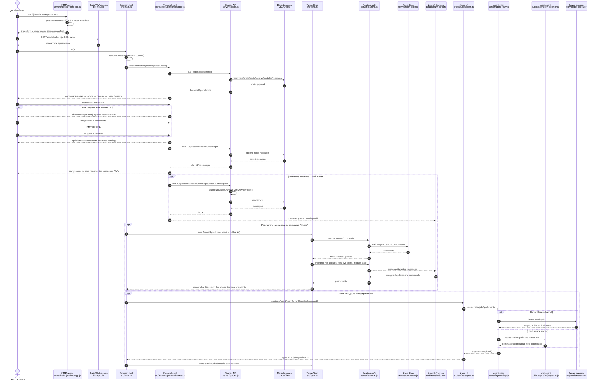
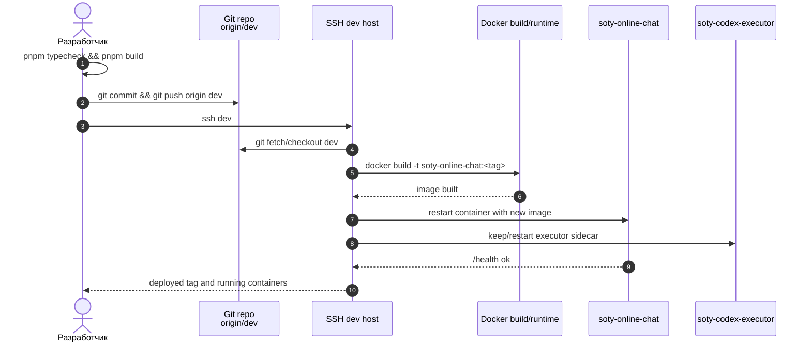

# Соты: карта проекта, узлы и sequence diagram

Дата проверки: 2026-06-05.

## Методика

- Посчитаны tracked-файлы из `git ls-files`.
- Бинарные артефакты не включались в LOC: сейчас это `docs/soty-architecture.png`.
- `DESIGN.md` и `output/` на момент проверки были untracked и в подсчет не входили.
- LOC = физические строки в текстовых tracked-файлах.
- Code-ish LOC = непустые строки без простых строковых комментариев `//`, `#`, `/*`, `*`, `*/`.
- Проверки проекта:
  - `pnpm agent:release:check` - успешно.
  - `pnpm payments:selftest` - сначала падал на устаревшем ожидании payment-enabled без legal-ready env; selftest изолирован от внешнего env и исправлен, затем успешно.
  - `pnpm agent:selftest` - сначала падал на устаревшем контракте видимой PWA install-кнопки в карточке; контракт обновлен под карточный сценарий, затем успешно: `scenarios=107`.
  - `pnpm typecheck` - успешно.
  - `pnpm build` - успешно; Vite оставил предупреждение о JS chunk больше 500 kB.

## Общая последовательность

## Runtime-сборка и деплой

## Узлы и размер

| Узел | Файлов | LOC | Code-ish LOC | Доля LOC | Главная роль |
|---|---:|---:|---:|---:|---|
| Agent and remote control | 10 | 32,195 | 30,799 | 37.8% | Локальный/серверный агент, relay, удаленные команды, артефакты |
| Browser app shell and UI | 13 | 19,352 | 17,628 | 22.7% | Главная клиентская оболочка, чат, QR, composer, runtime UI |
| Installers release and recovery tooling | 22 | 15,195 | 14,596 | 17.8% | Инсталляторы агента, recovery, release manifest, selftests |
| Personal cards and spaces | 4 | 6,106 | 5,704 | 7.2% | Карточки, публичные профили, записи, отзывы, сообщения, модули места |
| Feature modules | 14 | 3,466 | 3,184 | 4.1% | Шахматы, mini-apps, legal, payments, notifications, files |
| Realtime room sync | 3 | 3,142 | 2,937 | 3.7% | WebSocket/Yjs-синхронизация комнат, файлы, live state |
| Docs architecture and manifests | 9 | 2,867 | 2,204 | 3.4% | Документация, lockfile, манифесты |
| Agent learning and reports | 3 | 1,278 | 1,205 | 1.5% | Отчеты, обучение и санитарная обработка agent traces |
| HTTP server and runtime config | 9 | 899 | 836 | 1.1% | Express app, headers, static, health, конфигурация сборки |
| Trustlink client adapter | 8 | 587 | 520 | 0.7% | Клиентские invite/tunnel/device/storage/crypto адаптеры |
| Other tracked files | 3 | 71 | 58 | 0.1% | Git/Docker ignore metadata |
| **Итого** | **98 текстовых** | **85,158** | **79,671** | **100%** | Один бинарный tracked-файл исключен |

## Узел: HTTP server and runtime config

Основные файлы:

- `server/index.js` - входная точка Node/Express/WebSocket runtime.
- `server/http-app.js` - сборка Express app, статические файлы, CSP, SPA fallback.
- `server/frontend-capabilities.js` - серверная публикация возможностей frontend/runtime.
- `server/validators.js` - общие валидаторы входных payload.
- `Dockerfile`, `package.json`, `vite.config.ts`, `tsconfig.json`, `pnpm-workspace.yaml` - runtime/build config.

Основные функции:

- `createHttpApp(distDir, { dataDir })` собирает HTTP-приложение и подключает доменные API.
- `createRoomStore(dataDir)` создает хранение realtime-комнат.
- `attachRealtime(wss, store)` подключает WebSocket-слой.
- Upgrade `/ws/:roomId` проверяет same-origin и передает соединение realtime-серверу.
- `personalRouteHead()` и `applyPersonalRouteHead()` делают карточные метаданные для `@handle` маршрутов: title, icon, manifest.
- `applySecurityHeaders()` держит CSP, permissions policy и базовую защиту ответа.

## Узел: Personal cards and spaces

Основные файлы:

- `src/features/personal-space.ts` - публичная карточка и слои "визитка -> записи -> отзывы -> связь -> место".
- `server/spaces.js` - API и файловое хранение spaces.
- `src/features/space.ts` - клиентская модель пространства.
- `src/features/share-sheet.ts` - sharing UI.

Основные функции:

- `renderPersonalSpacePage()` рисует карточку как главный продуктовый сценарий.
- `personalSpaceRouteFromLocation()` определяет, что текущий URL является карточкой.
- `loadPersonalSpaceProfile()` читает профиль, записи, отзывы, модули и реакции.
- `sendPersonalSpaceMessage()` отправляет сообщение владельцу карточки.
- `loadPersonalSpaceInbox()` читает входящие с owner-proof.
- `uploadPersonalSpacePhoto()`, `updatePersonalSpaceProfile()`, `savePersonalSpacePost()`, `savePersonalSpaceModule()` обслуживают редактирование карточки.
- `bindPersonalSpace()`, `showMessageSheet()`, `showProfileSheet()`, `showShareSheet()` связывают UI-события.
- `openPersonalRuntimeModule()` переводит из простой карточки в рабочее "место".
- `attachSpaces()` подключает API: profile, photo, posts, reviews, messages, reactions, modules, manifest/icon.
- `authorizeSpaceOwner()`, `verifyOwnerProof()`, `verifyOwnerSignature()` защищают приватные owner-действия.
- `saveSpaceMeta()`, `saveSpacePhoto()`, `saveSpacePost()`, `saveSpaceReview()`, `saveSpaceMessage()`, `saveSpaceReaction()`, `saveSpaceModule()` пишут данные карточки.

## Узел: Browser app shell and UI

Основные файлы:

- `src/main.ts` - большой клиентский оркестратор приложения.
- `src/style.css` - основная визуальная система.
- `src/ui/tooltips.ts`, `src/ui/context-menu.ts` - вспомогательные UI-компоненты.
- `public/boot.js`, `public/sw.js`, `public/manifest.webmanifest`, `public/icon.svg`, `index.html` - загрузка, PWA-оболочка и статический bootstrap.

Основные функции:

- Boot/route: `showPersonalSpaceRoute()`, `renderSelfStartPage()`, `renderApp()`.
- Карточный старт: создает карточку из поля "Имя или название", затем раскрывает редактирование по мере необходимости.
- Чат и composer: `renderTextPaint()`, `finalizeComposerDraft()`, `createChatMessageLine()`, `parseChatMessageLine()`, `renderBubbleAttachment()`.
- QR: `showQr()`, `startQrScanner()`.
- Operator/agent bridge: `ensureOperatorBridge()`, `runOperatorCommand()`, `runOperatorScript()`, `sendAgentDialogMessage()`.
- Local agent execution: `runLocalAgentCommand()`, `runLocalAgentScript()`.
- UI-состояния: room state, tabs/layers, files, module snapshots, command output.

## Узел: Realtime room sync

Основные файлы:

- `src/sync.ts` - `TunnelSync`, клиентская синхронизация комнаты.
- `server/realtime.js` - WebSocket protocol и fanout.
- `server/room-store.js` - компактное хранение snapshot/update/files.

Основные функции:

- `TunnelSync` держит encrypted realtime state: Yjs text updates, chat messages, files, live drafts, notices, remote grants, commands/scripts/output, mini-app/chess/terminal snapshots, join requests.
- Клиент отправляет room events через WebSocket и применяет события от peers.
- `attachRealtime()` регистрирует WebSocket protocol.
- `handleHello()` отдает стартовое состояние комнаты.
- `handleMessage()` маршрутизирует encrypted updates.
- `storeUpdate()` и `storeFile()` сохраняют историю и файлы.
- `broadcast()` отправляет события всем участникам комнаты.
- `routeTargeted()` доставляет targeted-события конкретному device.
- `pendingJoinRequests()` и join/accept flow обслуживают вход в комнату.

## Узел: Trustlink client adapter

Основные файлы:

- `src/trustlink/invites.ts` - invite creation/join.
- `src/trustlink/storage.ts` - IndexedDB/localStorage persistence.
- `src/trustlink/tunnels.ts` - tunnel metadata.
- `src/trustlink/codec.ts` - encode/decode/encryption helpers.
- `src/trustlink/device.ts`, `runtime.ts`, `types.ts`, `index.ts` - device/runtime/types facade.

Основные функции:

- Создание и принятие invite.
- Хранение device/tunnel state.
- Кодирование/декодирование tunnel payload.
- Подготовка room auth для `TunnelSync`.
- Единый экспорт клиентских trustlink API.

## Узел: Agent and remote control

Основные файлы:

- `scripts/soty-agent.mjs` - исходный/скриптовый вариант агента.
- `public/agent/soty-agent.mjs` - публикуемый runtime агента.
- `server/agent-relay.js` - серверный relay job/event/channel слой.
- `src/features/agent.ts` - клиентский UI/adapter для агента.
- `src/features/remote.ts` - remote command helpers.
- `server/agent-relay/*.js` - sanitize, artifacts, waiters.
- `src/features/agent-identity.ts`, `src/features/local-agent-endpoint.ts` - identity/endpoint helpers.

Основные функции:

- `attachAgentRelay()` подключает HTTP API для каналов агента, jobs, events, artifacts.
- `getChannel()`, `resolveRequestChannel()`, `bestServerCodexChannel()` выбирают канал исполнения.
- `getAgentSource()`, `createSourceJob()`, `leasePendingSourceJobs()` обслуживают source-worker модель.
- `cleanupAgentSources()` чистит устаревшие workers/jobs.
- `relayEventsPayload()` нормализует поток событий для клиента.
- `checkLocalAgent()`, `checkLocalCompanionAgent()` проверяют доступность локального агента.
- `askLocalAgentReply()`, `resumeAgentRelayReply()` создают/продолжают agent jobs.
- `bindLocalAgentRelay()` связывает UI с relay.
- `grantAgentSourceAccess()`, `checkAgentSourceWorker()` управляют доступом source worker.
- `downloadAgentInstallerForDevice()` выдает подходящий installer.
- `scripts/public soty-agent.mjs` держат loopback API, worker/control plane, shell/script execution, MCP/ctl, artifacts.

## Узел: Feature modules

Основные файлы:

- `src/features/chess.ts` - шахматный модуль.
- `src/features/mini-apps.ts`, `src/features/runtime-modules.ts` - мини-приложения и runtime-модули.
- `src/features/web-controller.ts` - browser remote controller.
- `src/features/trust-ui.ts` - trust UI.
- `src/features/payments.ts`, `server/payments.js` - платежный контур.
- `src/features/legal.ts`, `server/legal.js` - legal/consent.
- `src/features/notifications.ts` - browser notifications.
- `src/features/message-dialogs.ts` - message dialog/thread markers.
- `src/features/files.ts` - file helpers.
- `src/features/quick-actions.ts` - быстрые действия.
- `scripts/payment-selftest.mjs` - selftest payment/legal readiness.

Основные функции:

- Chess: snapshots, legal moves, board state, agent move integration.
- Mini-apps: sanitize/search/layout/url/html for runtime modules.
- Web controller: `SOTY.remote` adapter for browser control.
- Payments: public config, payment intent/request flow.
- Legal: public legal config and consent persistence.
- Notifications: permission prompt, wake/display helpers.
- Files: display size, download/render helpers.
- Message dialogs: lightweight thread/dialog markers for chat.
- Quick actions: reusable action surfaces for app commands.

## Узел: Installers release and recovery tooling

Основные файлы:

- `scripts/build-agent-release.mjs`, `scripts/update-codex-runtime.mjs`, `scripts/agent-release/*` - сборка agent release и обновление Codex runtime.
- `public/agent/manifest.json` - опубликованный manifest агента.
- `public/agent/install-windows.ps1`, `public/agent/install-windows-machine-bootstrap.ps1`, `public/agent/install-windows-machine.cmd`, `public/agent/install-macos-linux.sh` - installer entrypoints.
- `scripts/windows/*`, `public/agent/windows-reinstall/*` - Windows reinstall/recovery tooling.
- `scripts/action-kernel-selftest.mjs`, `scripts/payment-selftest.mjs`, `scripts/soty-agent-eval.mjs` - проверки/eval.

Основные функции:

- Генерация public agent artifacts и manifest.
- Установка агента на Windows/macOS/Linux.
- Managed Windows reinstall и fast USB сценарии.
- Selftest action-kernel, payment flow и agent eval.
- Поддержка восстановления машины как части удаленного управления.

## Узел: Agent learning and reports

Основные файлы:

- `server/agent-learning.js` - API входа для learning/report.
- `server/agent-learning/report.js` - построение report.
- `server/agent-learning/sanitize.js` - санитарная обработка входных данных.

Основные функции:

- Прием agent learning traces.
- Нормализация и очистка чувствительных данных.
- Сбор отчета по agent sessions/events.
- Выдача server-side diagnostic payload.

## Узел: Docs architecture and manifests

Основные файлы:

- `README.md` - базовое описание.
- `docs/soty-current-dialog-master-plan.md` - продуктовый план текущего диалога.
- `docs/soty-mini-apps.md`, `docs/soty-agent-runtime.md`, `docs/soty-agent-triggers.md`, `docs/soty-memory-plane.md` - доменные документы.
- `docs/soty-architecture.svg`, `docs/soty-architecture.png` - архитектурная схема.
- `pnpm-lock.yaml`, `public/mini-apps/manifest.json` - lockfile/manifest.

Основные функции:

- Фиксируют продуктовую и runtime-архитектуру.
- Описывают mini-apps, agent runtime/triggers, memory plane.
- Lockfile обеспечивает воспроизводимую установку зависимостей.

## Самые важные наблюдения по проекту

1. Главный пользовательский путь теперь должен быть именно карточным: URL/QR -> карточка -> "написать" -> сообщение владельцу. Это уже выделено отдельным узлом, но он все еще живет рядом с очень большим `src/main.ts`, поэтому риск регрессий высок.
2. Самые крупные зоны - agent/remote и browser shell. Вместе они дают примерно 60.5% всех строк проекта. Любые изменения там требуют проверки типа `pnpm typecheck`, `pnpm build` и ручного сценария карточки.
3. `scripts/soty-agent.mjs` и `public/agent/soty-agent.mjs` имеют одинаковый размер по 14,574 LOC. Нужно держать один источник истины для агента и явно понимать, какой файл generated/published.
4. Vite предупреждает о большом JS chunk. Это не ломает билд, но подтверждает, что "соты и модули спрятать глубже" полезно поддержать технически: ленивой загрузкой агента, модулей и тяжелых рабочих поверхностей.
5. PWA сейчас остается инфраструктурным бонусом: manifest/service worker есть, но первый контакт должен работать как обычная быстрая ссылка без установки.
6. Проверочные контракты были чуть старше продукта: платежный selftest не учитывал legal-ready gate, а action-kernel ждал видимую install-кнопку. Оба исправлены под текущую формулу продукта.
